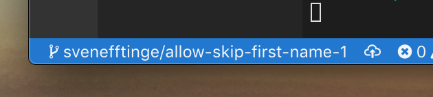

We're pretty excited to bring you instant development environments for all Bitbucket projects.

Simply type `gitpod.io/#` in front of any Bitbucket repository URL, and get a fully prebuilt and ready-to-code Gitpod workspace in seconds.

`youtube: hIpFTGwsv-o`

# Getting Started with Gitpod for Bitbucket

Starting a fresh dev environment for a Bitbucket project works just as with GitLab and GitHub: Simply prefix your Bitbucket project URL with `gitpod.io/#`.

For example, you could try opening this Spring PetClinic (Java) repository in Gitpod:

https://gitpod.io/#https://bitbucket.org/gitpod/spring-petclinic

For more convenience, you can also install Gitpod's browser extension (for [Chrome](https://chrome.google.com/webstore/detail/gitpod-online-ide/dodmmooeoklaejobgleioelladacbeki) and [Firefox](https://addons.mozilla.org/firefox/addon/gitpod/)), which will add a `Gitpod` button to all Bitbucket projects.

Gitpod also supports other types of Bitbucket URLs, like:

 - Opening file URLs

   
Example: <a href="https://gitpod.io/#https://bitbucket.org/gitpod/spring-petclinic/src/master/src/main/java/org/springframework/samples/petclinic/PetClinicApplication.java" target="blank"><b style="font-weight:700;">https://gitpod.io/#</b>https://bitbucket.org/gitpod/spring-petclinic/.../petclinic/PetClinicApplication.java</a>

 - Opening branches

   
Example: <a href="https://gitpod.io/#https://bitbucket.org/gitpod/spring-petclinic/src/my-branch/" target="blank"><b style="font-weight:700;">https://gitpod.io/#</b>https://bitbucket.org/gitpod/spring-petclinic/src/my-branch/</a>

 - Opening issues

   
Example: <a href="https://gitpod.io/#https://bitbucket.org/gitpod/spring-petclinic/issues/1/make-first-name-optional" target="blank"><b style="font-weight:700;">https://gitpod.io/#</b>https://bitbucket.org/gitpod/spring-petclinic/issues/1/make-first-name-optional</a>

 - Opening pull requests

   
Example: <a href="https://gitpod.io/#https://bitbucket.org/gitpod/spring-petclinic/pull-requests/1/allow-omitting-first-name/diff" target="blank"><b style="font-weight:700;">https://gitpod.io/#</b>https://bitbucket.org/gitpod/spring-petclinic/pull-requests/1/allow-omitting-first-name/diff</a>

Depending on the context, your dev environment will be initialized differently.

For instance, if you start a workspace from the issue context above, you’ll get a fresh workspace with a new local branch based on the repository's default branch (e.g. `master`).

The new local branch will be named like `<username>/<issue-title>-<issue-nr>`, in my case it is:
`svenefftinge/allow-skip-first-name-1` (if the issue title is too long, only the first few words will be included in the branch name).

## Configure your project

To get the most out of Gitpod, you should describe your project's dev environment with code. Dev environments are based on containers which you can configure through a custom `Dockerfile`.

Furthermore you can specify which tasks should run after a fresh checkout in a `.gitpod.yml` file. Usually these tasks include build steps, downloading dependencies and running some unit tests. Read the section below on prebuilds to make Gitpod automatically run these steps ahead of time, as a CI pipeline whenever some changes are pushed to your project.

There is much more you can do to make sure every team member gets a ready-to-code dev environment when they need one. Please refer to the [docs](/docs/configuration/) for details.

## Prebuilds

Gitpod’s [prebuilt workspaces](/docs/prebuilds/) are key to providing ephemeral, ready-to-code dev environments for your branches and projects. You can configure Gitpod to run your project's build asynchronously every time someone pushes new commits or branches to your repository. So when a developer wants to start coding, she can start immediately, because everything is already prepared.

Enabling prebuilds on your Bitbucket project is done by configuring a Webhook. This can be done automatically: Just trigger the first prebuild on your project manually, and Gitpod will take it from there. To do that, use the prefix `https://gitpod.io/#prebuild/`, as in
> __https://gitpod.io/#prebuild/__`https://bitbucket.org/<myuser>/<myrepo>`

## We Need Your Feedback

If you have ideas how Gitpod can be improved for you, or if you notice a bug, please always feel free to [reach out](https://github.com/gitpod-io/gitpod/issues). We would also be glad to welcome you in our [community](https://community.gitpod.io). ❤️
