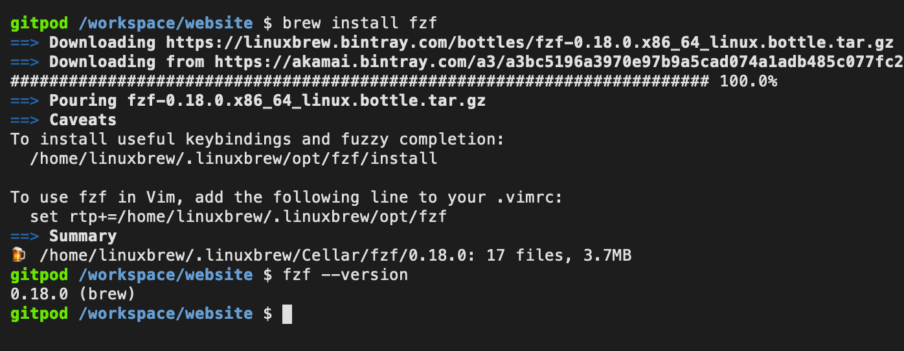

Are you tired of **apt-get**? Can't use **sudo** right now? …

## You can now '**brew install anything**' in Gitpod! 🎉

- ✓ Easily install any Linux tool or package with one command
- ✓ Doesn't require `sudo` permission
- ✓ Works in your [.gitpod.Dockerfile](https://www.gitpod.io/docs/42_config_docker/) or directly in Gitpod's Terminal

If you use a Mac, or have friends who use a Mac, you've probably heard of the trusty [brew](https://brew.sh/) command which allows you to install pretty much any software, from `git` to `clang` to `htop`.

Homebrew is quite convenient, and its packages are very well maintained: You'll usually get the latest stable version of any tool (e.g. Git `2.24.1`) while other package managers can typically lag several versions behind (e.g. Ubuntu 18.04 only gives you Git `2.17.1` by default).

What you may not necessarily know is that Homebrew now works on Linux too (it was originally announced as "Linuxbrew", but now it's just called [Homebrew on Linux](https://docs.brew.sh/Homebrew-on-Linux)). This got us pretty excited, because we saw it as an opportunity for developers to easily install any software package in Gitpod, without needing to set up a Dockerfile and then fire up another workspace to test it. With Homebrew you can simply run `brew install z` and get going!

We've pre-installed `brew` for all Gitpod workspaces (using [workspace-full](https://github.com/gitpod-io/workspace-images/blob/d353ffe08c602095a8f3df7d690934c25643a6ca/full/Dockerfile#L104-L107)) and now that we've played with it for a while and are happy with the experience, we're excited to announce it so that you can try it too:

1. Just open any repository in Gitpod (e.g. the [Spring PetClinic](https://gitpod.io/#https://github.com/gitpod-io/spring-petclinic))
2. Try running `brew install fzf` (this should give you the awesome [fzf](https://github.com/junegunn/fzf) tool)

Here are a couple details to be aware of:

- Packages installed with `brew` have a low priority in the `$PATH`. This means that if you `brew install` a package that already exists in Gitpod, you'll just continue using the old package. If you don't like that, simply `apt-get remove` the old package in your [.gitpod.Dockerfile](https://www.gitpod.io/docs/42_config_docker/).

- `brew` installs everything under `/home/linuxbrew/`, but Gitpod only backs up your Docker image plus everything inside `/workspace/`. This means that if you `brew install fzf` in a Gitpod terminal, and then your workspace stops running, when you restart it later the package `fzf` will be gone. If that's a problem, simply move the `brew install fzf` command into your [.gitpod.Dockerfile](https://www.gitpod.io/docs/42_config_docker/) to make it permanent.

We hope this feature makes you as happy as it made us! Please share any [feedback, thoughts](https://community.gitpod.io/) or [bugs](https://github.com/gitpod-io/gitpod/issues/new/choose) you found.
