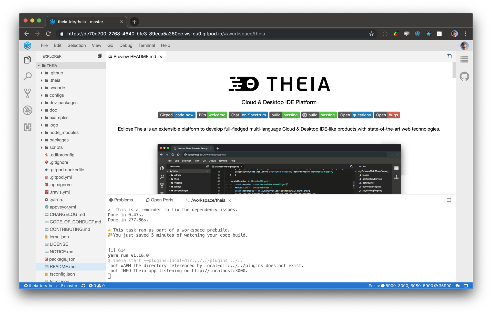

[DevOps](https://en.wikipedia.org/wiki/DevOps) has been all the rage for the last couple of years. Today, something like GitHub / GitLab with Continuous Integration seems to be the absolute minimum for a decent development toolchain. Such tools allow faster feedback cycles, better reproducibility, and generally more productivity.

> However, in one crucial aspect most of us are still wasting many hours every day.

Getting our dev environments into a ready-to-code state is usually still done manually, wasting an endless amount of precious developer time and energy.

> Dev environment provisioning can and should be automated.

**Continuous dev environments** are a crucial part in a fully optimized DevOps toolchain, that allow to instantaneously spin up a ready-to-code development environment from any git state. Continuous dev environments reduce friction in onboarding and task switching and improves reproducibility across the project.

## Automated Dev Environments
Automating dev environments is not new and usually focusses on the initial setup, but that doesn't quite cut it. Of course, we all have felt the pain of being on-boarded in a new project, spending the first week figuring out what tools to install and how to configure them correctly. Manually setting up a dev environment is a waste of energy. Surprising that we still do such things, given that we developers are usually busy automating everything else in the world.

But it is not only the one-off onboarding I want to discuss. Our projects change over time, and so do our dev environments. Developers are switching between different versions of a project. They, therefore, have to adjust parts of the dev environment accordingly, all the time.

We should automate dev environments using code, just as we do with testing, staging and production environments for continuous deployments.

> When a developer wants to start a task, on some branch, in some project, she should be able to do so without spending hours on getting into the right environment.

## Disposable Dev Environments

Automating a dev environment means we can recreate it any time. Starting fresh every time will make sure the setup works correctly and that you get a clean state. Since the build and the tests ran through and the dependencies are all fresh, you can be sure that any problems come from your changes. Such a setup makes it super easy to reproduce bugs, as well.

Moreover, a use-once dev environment frees you from cleaning up afterward. You never pollute your local system with any heavy checkouts, dependencies, builds, databases, and the like. Enter zero-waste coding.

It's almost 2020 and we understand that automating complex systems through code and configuration is vital. Now, let's apply those lessons learned to our dev environments.

## Prebuilt Dev Environments - No More Waiting for Builds!

Initial setups are annoying, but the real time sink is [waiting for builds](/blog/prebuilds). Compilers, generators, downloading dependencies, and running tests need to be executed to initialize your dev environment.

Just like CI tools that build your project after you have submitted a change, a continuous dev environment service builds your project **before** you need it. That way you can start on a clean state immediately.

> A tool for providing continuous automated dev environments should prebuild your project, so you don't have to wait.

Gitpod prebuilds your branches continuously, so that you can start coding immediately without having to wait for builds to complete. Starting a new dev environment and seeing belows output in the terminal makes me smile every time.

Try below's example to see the effect of prebuilds in action. 👇

## Browser-based Dev Environments?

> "Browser-based? I need professional tools!"

Yes, I hear you. Until recently, browser-based tools haven't been as powerful as what we use locally.

But times have changed. Today, [we can run a VS Code compatible IDE in a browser tab](https://theia-ide.org) together with complete terminals to dedicated Linux containers. And everything is specially configured for your project.

The Theia IDE open-source project is fully configured with continuously prebuilt dev environments. You can try it out yourself by clicking the link below.

> https://gitpod.io/#https://github.com/theia-ide/theia

## But my environment is different than those from my teammates!
Yes, of course, there are personal preferences like themes, keybindings, or even one or the other tool. Some developers heavily use command-line tools and have very advanced configurations. Others use particular VS Code extensions that improve their workflow significantly.

> Why don't we share all that goodness within the team?

While [Gitpod](/) lets you have user-specific settings, we see an opportunity in sharing the wisdom within the team to ***build a perfect, friction-free setup for everyone***. This way, you can share your impressive terminal skills and configuration with your team, and you might learn a new thing or two as well.

## The missing piece in DevOps
I'm pretty sure, automated ready-to-code dev environments will become mainstream. The advantages and implications are just too good to be ignored. Everyone who has understood and experienced the benefits of a proper DevOps toolchain should understand how providing dev environments on-demand completes that experience. Ironing out that last area of non-reproducible and very annoying yak-shaving should be high on our todo list as it will improve developer productivity drastically.

Gitpod is available [to open-source projects for free and affordable for commercial projects](/pricing), through the Saas offering (Gitpod.io). [Gitpod Enterprise](/pricing#enterprise) will soon be released, allows self-hosting Gitpod on any Kubernetes cluster, and integrates with GitHub Enterprise, GitLab, Jenkins, JIRA and other tools in your DevOps toolchain.
