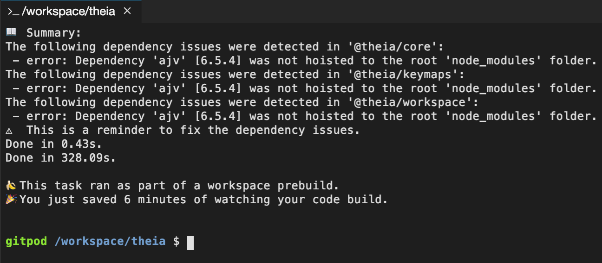

Every day developers waste millions of hours switching contexts between projects and branches, setting up development environments or simply waiting for builds to complete.

This friction is not only time consuming but is a serious barrier for contributors. Reading through a long list of setup instructions and messing up my own laptop is just too much effort.

Today, we are happy to announce the launch of [Gitpod.io](https://gitpod.io), an online service that provides disposable, ready-to-code development environments for GitHub projects.

## One-Click Dev Environments for GitHub
The idea is simple: You are on GitHub and want to start working on some project. Instead of going through the manual setups, etc. you simply click a button. A ready-to-code dev environment is started in your browser. You can now code, review or just try out the project. Once you are done you simply close the tab.

You don’t see the button on GitHub yet? You need to [install a small browser extension](/docs/20_Browser_Extension) to have it. Alternatively, you can just prefix any GitHub URL with “https://gitpod.io/#”.

You can try Gitpod right now. It's free for public repositories.

## No Setup
Not all projects are equal. We maintain a [developer friendly docker image](https://github.com/gitpod-io/workspace-images/blob/master/full/Dockerfile) that includes all the commonly used tools and version managers. But you can point to your own docker image in a __.gitpod.yml__ file. Gitpod will pick it up and even build the image if needed. Read [Gero's post](/blog/docker-in-gitpod) for more details.

With Gitpod contributors don’t need to go through a list of usually outdated setup instructions. Instead, they get exactly what they need for the project at hand with no additional effort. As a side-effect, any **works-on-my-machine** scenarios are eliminated, because every team member uses the same working setup on the same kind of machine in the cloud. Since the __.gitpod.yml__ is versioned with the code, going back to old releases and branches becomes super easy, too. We call this [dev environment as code](/blog/dev-env-as-code).

To optimize the experience, the __.gitpod.yml__ accepts [further configuration](/docs/40_Configuration), where you can automatically start builds, watchers and dev servers in multiple terminals. You can configure how they appear in the IDE layout and hook up all your web ports and previews.

As a project owner you should do everything you can to streamline the experience for contributors, so everybody including yourself can focus on being creative and writing code. Gitpod lets you automate the setup and make sure developers get beamed into a dev environment that really is ready to code.

A great example is [ssloy's tinyraytracer project](https://github.com/ssloy/tinyraytracer/wiki). It's a tutorial for raytracing in C++ and is configured so it runs the build and automatically opens the rendered graphics. The author has even added Gitpod buttons to individual steps in the tutorial to make following along easier.

## Less Waiting
There is an additional bit of friction, that every developer has to go through regularly:

Running the build and downloading dependencies.

Starting today, [the new Gitpod app is available on the GitHub marketplace](https://github.com/marketplace/gitpod-io). It is the first of its kind and the only one in the new IDE category.

Once you've installed the app for your GitHub repository, it will pre-build dev environments on every commit. So when anybody opens a Gitpod environment on your project, the dev environment is opened as described above. But now also the build ran through and all dependencies are already there.

We call this feature prebuilt workspaces and you can read more about it in [Chris' post](/blog/prebuilt-workspaces).

## More Flow
The dev environments open differently depending on the GitHub page you are coming from. You can, for instance, open branches or files by simply going to the respective GitHub page and pressing the button (or prefixing the URL) there. 

When coming from an issue, Gitpod understands you want to fix it, so you’ll get a fresh local branch and the commit message is prepared with a reference to the issue.

Starting a workspace from a pull request will open in code-review mode. The list of changes is opened on the left so you can easily go through them and view the details in diff editors on the right. Of course, you can comment within the IDE and even submit your code review.

Even if you prefer your local machine for development, being able to do [deep code reviews](/blog/when-code-reviews-lgtm) in a browser is a great way to improve your workflow.

## Not Just a Playground
While Gitpod keeps the convenience and accessibility of online coding playgrounds and sandboxes, it is not a toy but a complete dev environment running in the cloud. 

We teamed-up with Google, Ericsson, Arm and Red Hat to develop the open-source project [Eclipse Theia](https://theia-ide.org). The project puts [VS Code](https://code.visualstudio.com/)’s state-of-the-art technology and UX into the browser based on an extensible architecture that optimized for the cloud.

In addition to one of the best code editors, Gitpod environments provide full featured terminals backed by Linux containers running in the cloud. As a result, you get the same command line tools you would use locally together with the hottest IDE tech available today. And all of that in a browser tab.

## VS Code Extensions
Gitpod will very soon allow installing VS Code extensions directly from the marketplace. Some of the language support is already powered by VS Code extensions. Support in Theia is at roughly 95% so we don’t yet open up that possibility to users as we want to stabilize the integration further, but Gitpod already comes with several VS Code extensions pre-installed. For instance, the Go support comes from Microsoft’s very decent extension (https://github.com/Microsoft/vscode-go). We will be adding more popular VS Code extensions shortly, and later allow users to define any extensions they want.

## Collaboration
Gitpod comes with two major features supporting collaboration.
 - [Sharing running dev environments](/docs/33_Sharing_and_Collaboration) with other users comes in handy if you want to look at code with a colleague to hunt down a bug together or do some pair programming. Collaborators will see the same code you see and even the terminals are synced and shared.

 - [Snapshots](/blog/workspace-snapshots) are useful in many ways. In a nutshell, they allow taking an immutable copy of your dev environment at any point in time. You can share the provided link wherever you want. Users opening such a snapshot link will get an exact clone of the environment including all state and even UI layout. This feature is great for sharing reproducibles in issues, but also good for blog posts or solutions on Stack Overflow.

## Pricing – Unlimited & Free

An important part of leaving the beta was to find a good pricing model that addresses the needs for the various user groups.

We think we have found a good balance by providing 
 - a **free 100-hour subscription** for open-source development, 
 - a **paid 100-hour subscription** for individuals working privately, and
 - a **paid unlimited subscriptions** for professional use. 
 
 _(I know some of you are lucky enough to do professional open-source. Decide what works best for you in that case ;-))_

We also offer **team subscriptions**, which allow managers to buy a batch of subscriptions and provide them to the team.

And, of course, a special **students discount** is in store, eligible if your primary GitHub URL belongs to an educational institution.

## Summary
Gitpod removes tedious plumbing tasks and reduces painful waiting time. We no longer need to maintain and sync our dev environments manually but can rely on a reproducible setup. All you need is a browser.

We are looking forward to seeing how this improves contributor experiences on open-source projects, simplifies workshops & hackathons and just in general lets developers spend more time being creative and in the flow.

Gitpod is free for open-source and available now.

## Thank You ❤️
I want to take the opportunity to thank all the people who have helped to make Gitpod a reality. All the enthusiastic early adopters who provided great feedback during the beta phase, contributors who have helped to identify bugs and sharing their use cases and of course the Eclipse Theia community working with passion on an open-source IDE platform for the future.

Finally, of course, I want to send a big shout out to the TypeFox team. You are absolutely awesome and being able to work with you on such a great product is everything I want.
