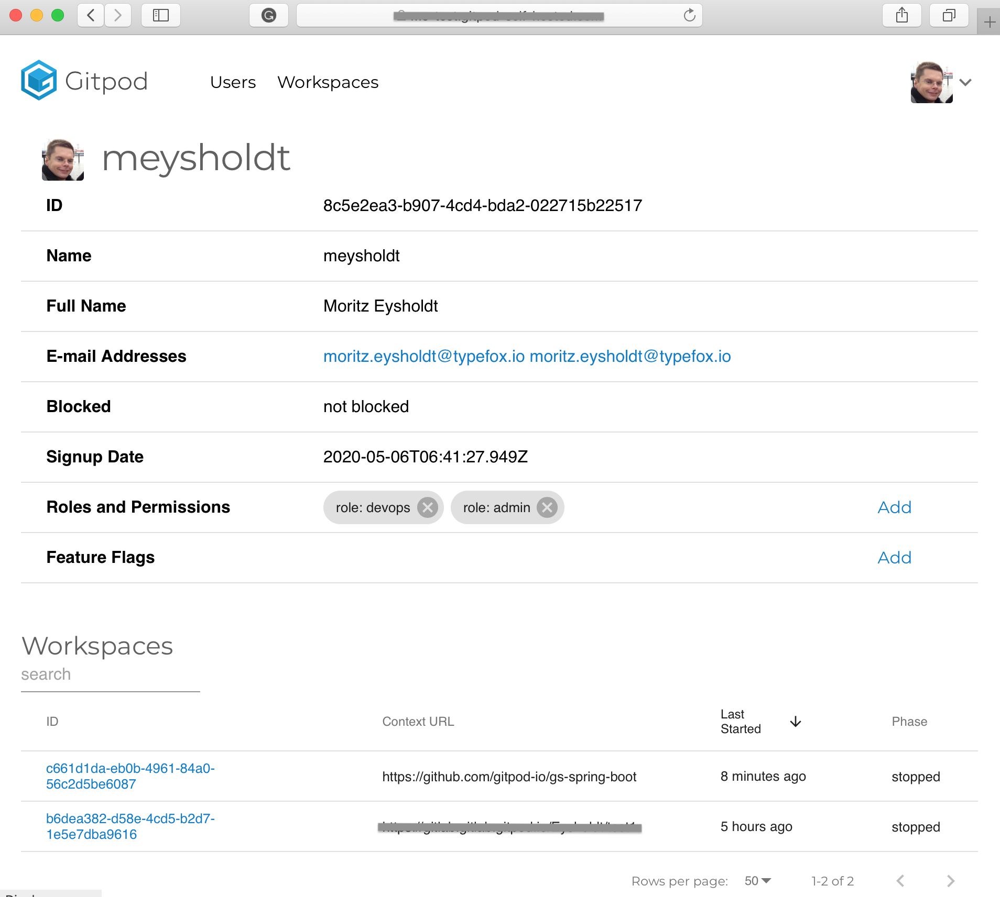

We are excited to announce the new release of Gitpod Self-Hosted in version 0.4.0. Gitpod Self-Hosted allows everyone to set-up and run  a service with the same features as gitpod.io in your cloud or corporate network.

### How Does it Work?

Gitpod Self-Hosted runs on Kubernetes and is easily installed via "helm install". On gitpod.io you can find detailed documentation and some automation to install Gitpod on [vanilla Kubernetes](https://www.gitpod.io/docs/self-hosted/0.4.0/install/install-on-kubernetes/) or [on Google Cloud Platform](https://www.gitpod.io/docs/self-hosted/0.4.0/install/install-on-gcp-script/). For the next release, we plan to add support for AWS, Azure, and OpenShift.

Users log into Gitpod via OAuth from your self managed Gitlab or GitHub enterprise. This ensures that all access privileges from your Git hosting solution are taken into account and that there is no additional administrative effort for managing user accounts.

Gitpod Self-Hosted is truly self-hosted: it does not require an internet connection to operate as every single bit runs on your network, and Gitpod Self-Hosted won't call home.

Operating Gitpod in production on gitpod.io has enabled us to battle-harden this product at scale. Both offerings share the same codebase, hence offer the same qualities regarding scalability, cloud-density, reliability, and security. All improvements that we make on Gitpod’s SaaS offering directly benefit the self-hosted version.

This release ships a plethora of bugfixes and improvements, particularly in the area of GitLab integration.
There is one major feature that I want to show in more detail since you can't try this on gitpod.io:

### New Admin UI

This release ships with a new web UI for administrative tasks. The UI is particularly handy when providing support fo users.
It allows for easy listing and searching of users and worksapces.
When selecting a user, the UI will show the user's details and workspaces, as you can in the following screenshot:

    

To try the new admin interface in Gitpod Self-Hosted, you'll need to assign the "admin" privilege to your user and open /admin in your browser.

### Getting Started

The fastest way to get started is by installing Gitpod Self-Hosted [on Google Cloud Platform](https://www.gitpod.io/docs/self-hosted/0.4.0/install/install-on-gcp-script/). There is also more in-depth documentation available on how to install Gitpod on [vanilla Kubernetes](https://www.gitpod.io/docs/self-hosted/0.4.0/install/install-on-kubernetes/).

Gitpod Self-Hosted is free for up to five users. For more users, you can obtain a [free one month trial](https://gitpod.io/selfhosted-trial/) or see our [pricing page](https://www.gitpod.io/pricing/#self-hosted).

For Gitpod’s next releases you can expect support for Atlassian’s Bitbucket, as well as install guides for Azure, AWS and OpenShift.
