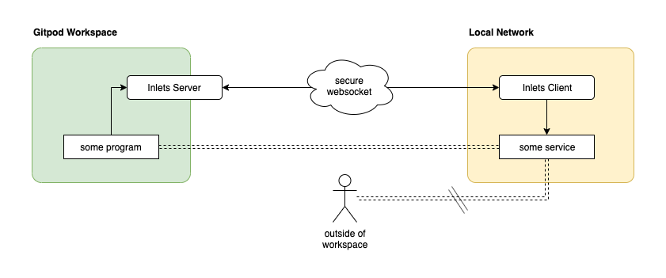

Some things just aren't exposed to the internet. Either because we do not want them out in the open, think some on-prem database, or because they cannot easily be made available like the Docker daemon on your laptop.
With your Gitpod workspace running in the cloud it does not have access to local services, which could render Gitpod unsuitable in those cases.

There's a range of [different](https://developers.cloudflare.com/argo-tunnel/) [offerings](https://ngrok.com/) and [projects](http://serveo.net/) that aim to expose local services to the internet. However, they all do so indiscriminately. I.e. if one knows the URL to your now-public endpoint, they have access to your service.
On top of that, they do incur additional cost if used often.

## Inlets to the rescue



[Inlets](https://github.com/inlets/inlets) is a great piece of kit written by [Alex Ellis](https://twitter.com/alexellisuk) which is basically the Open-Source version of the services mentioned above.

> Of course you can [contribute to inlets](https://github.com/inlets/inlets#development) itself using Gitpod.

It consists of a server which would run in your workspace, and a client which would run on your local machine. The client then acts as a kind of reverse proxy into your local network opening it up to programs running in your Gitpod workspace.

Making this work involves running both, the server and client:

1. download and run inlets in your workspace:

```
curl -sLS https://get.inlets.dev | sh
export token=$(head -c 16 /dev/urandom | shasum | cut -d" " -f1)
echo "token:  $token"
echo "remote: $(gp url 8090 | sed -e 's/https/wss/')"
./inlets server --port 8080 --control-port=8090 --token="$token"
```

Gitpod will show you notifications that there are new services on the ports `8080` and `8090`. Expose the port `8090` and leave the other one as is.

2. run the inlets client on your local machine. The remote address and token are printed by the commands executed in step one.

```
inlets client --remote=<see-above> --token=<see-above> --upstream=<local-addr>
```

There's a lot going on there, so let's look at things in detail.
In the workspace we first download `inlets` using its shell installer (we could have used `brew install inlets`, too, but that's a tad slower). Then we produce a token which prevents unauthorized access to our inlets server. Note that without tokens, the handshake performed by the inlets client and server fails.

When starting the inlets server, we seperate the control port from the server port. We do this so that we can expose one port, but not the other. This way the control port is exposed to the internet (albeit secured with the access token), but the server port is not. This way we do not expose our local service globally, but only make it available within our Gitpod workspace.

On the client side (where I just assumed you already have [inlets installed](https://github.com/inlets/inlets#install-the-cli)), we need to connect to the server we just started. To that end we use the corret remote URL (note the `wss://`) and token.
What you choose as `--upstream` depends on which kind of service you want to expose. Suppose you had a webserver running on port 8080 (e.g. `curl lama.sh | sh`), then this would be `--upstream localhost:8080`.

## Example 1: your local Docker daemon

Running a container engine like Docker or `containerd` in a Gitpod workspace is still [work-in-progress](https://github.com/gitpod-io/gitpod/issues/755). Until that's possible your only recurse is to connect to a remote daemon.
Usually that daemon would run somewhere in the cloud, too, e.g. in your dev-cluster. However, some of us don't have a Kubernetes cluster laying around or just need access to docker to try something real quick.

> This is _not_ how we plan to ultimatively support Docker/other containers in a Gitpod workspace.

Using inlets you can make the Docker enging running on your local machine (or in your local network) available in your Gitpod workspace.

I've gone ahead and prepared a prepared an [example repository](https://github.com/32leaves/gitpod-goes-local/tree/docker) that demonstrates this idea:

[](https://gitpod.io/#https://github.com/32leaves/gitpod-goes-local/tree/docker)

Once the workspace is up and running, follow the instructions in the upper-left terminal to complete the setup.

## Example 2: Home Automation and IoT

Suppose you're developing a [Flutter based app](https://medium.com/@jacksonz666/gitpod-flutter-productivity-on-the-go-for-mobile-app-developers-cc2495049d52) for your disruptive new smarthome product.
Chances are that the device side of that product isn't exposed to the internet just yet, but only available in your local network.
If that thing, as in Internet of Things, is speaking something akin to HTTP (like Yamaha's MusicCast or anything gRPC based) you could just replicate the setup above, except that you'd substitute Docker for the API you're trying to talk to.

While are plenty of other services in this space that speak HTTP, think InfluxDB, OpenHAB or Prometheus, some don't.
Most notably [MQTT based](https://en.wikipedia.org/wiki/MQTT) broker or the [bulk](https://www.eclipse.org/hono/) of [AMQP](https://en.wikipedia.org/wiki/Advanced_Message_Queuing_Protocol) based services.

Inlets does not [support tunneling TCP](https://github.com/inlets/inlets-pro-pkg). There is yet another project that can shovel TCP through an HTTP tunnel: [chisel](https://github.com/jpillora/chisel).
By combining the two, you can have programs in your workspace talk to TCP services in your local network/on your machine.

## Wrapping up

This day and age it's rare enough to find a situation where the service you want to talk to isn't available on the Internet (outside of corporate policy, that is).
If you do find yourself in that situation however, that's no reason to relinquish the convenience and benefits of Gitpod.
