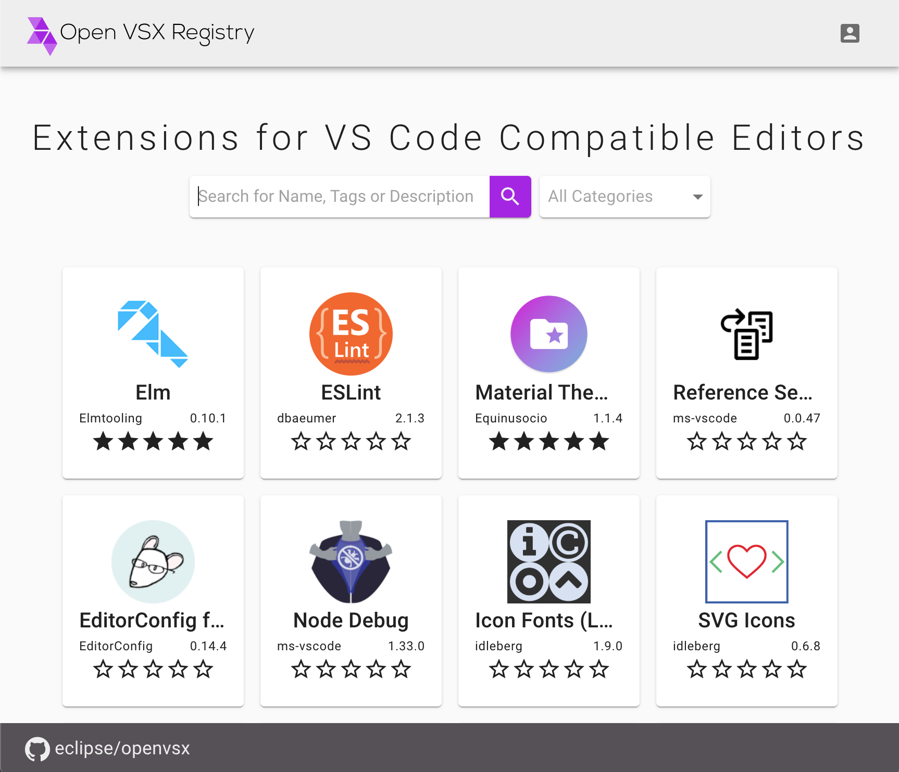

VS Code is used by [more than 50% of all developers worldwide](https://insights.stackoverflow.com/survey/2019#technology-_-most-popular-development-environments). Its extension protocol enabled the broader developer community to create over 16,000 extensions supporting all major programming languages, frameworks, and tools used in modern software projects. While large parts of VS Code are developed as open-source, the actual product (Visual Studio Code) is [not open-source](https://code.visualstudio.com/docs/supporting/FAQ#_what-does-built-on-open-source-mean).

[Eclipse Theia](http://theia-ide.org), the IDE powering Gitpod, Google Cloud Shell and others, offers a vendor-neutral alternative and is based on parts of the same open-source codebase as VS Code. Theia not only works as an Electron-based desktop app, but also runs in browsers. Furthermore, a highly flexible architecture allows extensive customizations. [Arduino’s new Pro IDE](https://www.arduino.cc/pro/arduino-pro-ide) or [Arm’s Mbed Studio](https://os.mbed.com/studio/) are great examples of Theia’s flexibility. On top of that built-in flexibility, Theia can run VS Code extensions as well.

Another project, [VSCodium](https://github.com/VSCodium/vscodium), offers a 100% open-source version of VS Code.

## Only Visual Studio Products May Access The Marketplace

While all the projects above support VS Code extensions, only Microsoft products can use and connect to Microsoft’s [Extension Marketplace](https://marketplace.visualstudio.com/vscode). Its [Terms of Use](https://aka.ms/vsmarketplace-ToU) prevent any non Visual Studio products to access the marketplace.

Gitpod employs a workaround where users can upload .vsix files to install extensions. This causes unnecessary friction as users have to download those files directly from GitHub, just to re-upload them to Gitpod. Downloading from the Microsoft Marketplace for any use other than in Microsoft products is prohibited, too.

Most extensions are developed by the community and published under permissive Open Source Licenses. Having to distribute and access these community-owned extensions in a system with such restrictive terms of services does not seem right. We want to fix this and host an open-source extension registry at the vendor-neutral [Eclipse Foundation](https://www.eclipse.org/org/foundation/).

## You Can Host Your Own Registry

In addition to providing a publicly hosted, vendor-neutral extension registry, we also make the code available as open-source. This way everyone can install their own registry and use it, e.g. inside a company network. As a result, you are not forced to publish proprietary extensions to a public marketplace, but maintain precise control over their availability. This is very similar to common practice found in other ecosystems such as npm, Cargo or Maven.

## Open VSX

This new registry is developed and maintained under the [Eclipse Open VSX](https://github.com/eclipse/openvsx) project. It contains the registry server, a web interface and a CLI to make publishing easy.

The publicly hosted instance is available at [https://open-vsx.org](https://open-vsx.org), and the upcoming Theia version 1.0 will use this installation as default registry.

Open VSX defines its own API, because Microsoft’s VS Code Marketplace API is proprietary and undocumented. An adapter between these two APIs is possible, planned and required to connect VS Code/VSCodium to Open VSX.

## Publishing

We would love to see extension developers publish to our registry in addition to Microsoft’s. To that end we developed a CLI that makes publishing a breeze. The basic four steps to publish your extensions are:

1. Register on open-vsx.org through [GitHub OAuth](https://open-vsx.org/oauth2/authorization/github)
2. [Create an access token](https://open-vsx.org/user-settings/tokens) and copy it
3. Run `npx ovsx create-namespace <publisher> -p <token>` with the publisher name specified in the extension’s package.json
4. Run `npx ovsx publish -p <token>` in the directory of the extension you want to publish

Visit the [Open VSX Wiki](https://github.com/eclipse/openvsx/wiki/Publishing-Extensions) for a more in-depth explanation of the publishing process.

## Seeding the Registry

Until extension developers start publishing to open-vsx.org themselves, we will publish open-source extensions through a script that is maintained in a [GitHub repository](https://github.com/open-vsx/publish-extensions). A continuous integration build regularly runs through the list of changes and automatically deploys all the listed projects. If you are missing a certain extension, you can do the following:

1. Ask the original maintainer to publish to open-vsx.org, pointing them to this post for context.
2. If the maintainer does not respond, create a PR to https://github.com/open-vsx/publish-extensions

## Final Words

The VS Code team is doing a great job building a developer experience that is loved and used by more and more developers. The large ecosystem of extensions is unique and provides state-of-the-art tool support for all modern programming languages, frameworks and tools.

We believe that the assets released as open source should remain readily available to everyone. A vendor-neutral, community-driven marketplace for VS Code extensions is an important first step to make this happen.
