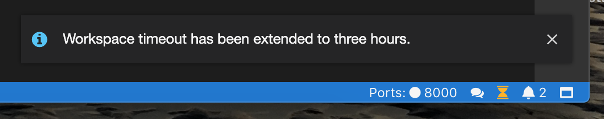
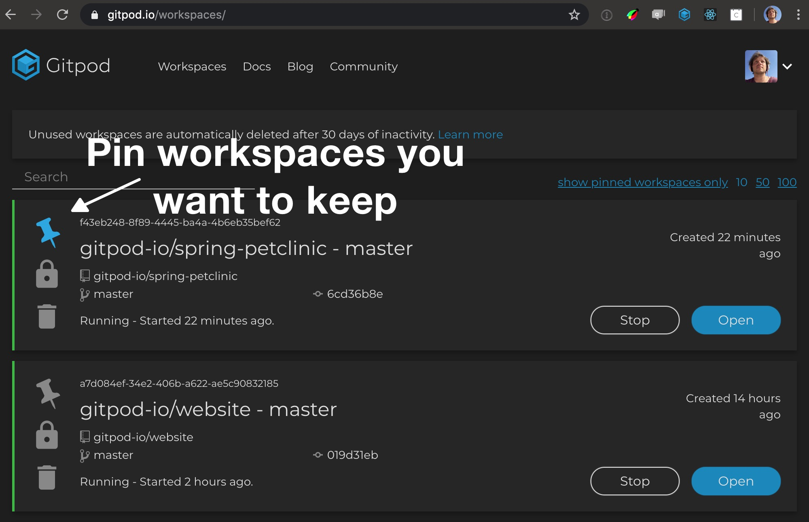

Ho ho ho! Christmas came early!
We’ve just released a bunch of exciting new features and I'm not talking about [Gitpod Enterprise](/enterprise/) which was announced last week or the [GitLab support](/blog/gitlab-support/) we've shipped the week before.

 - 🔓[Try with Your Private Repositories For Free](#private-project-trial)
 - 🛠[Get Your Projects Setup with an Assistant](#setup-assistant)
 - 🤗[New, Cheaper Plans with More Features](#new-plans)
 - 🌓[Light and Dark Theme](#light-theme)
 - ♻[Automatic Garbage Collection](#garbage-collection)
 - 💬[New Community Forum](#new-community-home)

## 🔓 Private Project Trial
Users can now try Gitpod on their private GitHub and GitLab projects for one month for free without providing payment information or automatic subscription start afterward.

To get started, simply prefix your private repository’s GitHub or GitLab URL with __gitpod.io/#__ and go through the OAuth flow. To fully get the hang of Gitpod, you need to configure your project accordingly. You can either [schedule a call](https://calendly.com/gitpod/onboarding) with an engineer, study the [documentation](/docs/configuration/), or use the new and shiny setup assistant.

## 🛠 Setup Assistant
Although setting up a project for Gitpod is usually a one-off effort, it can be a little involving depending on the complexity of the project's structure. With the arrival of a new setup assistant configuring Gitpod has become a whole lot easier now.

The assistant informs you through a small notification when your project lacks a `.gitpod.yml` and guides you through a 5 step process to create, test and propose a proper Gitpod configuration.

You can of course try it out on an arbitrary open-source project, too. We want the assistant to become really smart over time and understand all kinds of languages and build tools. So please share ideas and other kinds of feedback.

`youtube: IRzCR0r7DSE`

## 🤗 New Plans
We have reworked the plans and added a bunch of features to them as well.

### Free for Open Source ❤️
So far Gitpod has been free to use on public repositories for up to 100hours/month. We analyzed how people have been using Gitpod and found out that while a lot of people use it regularly for open-source work and reach the 100 hours limit, there are others using the free plan to run their expensive processes and builds (miners and the like are automatically killed, btw, and are violating our terms) which is not what we had in mind when offering a generous open-source plan.

To protect us from such miss-use and at the same time better support open-source work, we made the following two changes:

1) Add a __free, unlimited hours for professional open-source developers__.
2) Reduce the free plan to 50h/month, which is still plenty for part-time contributors and trying Gitpod.

Please [apply](/contact/) for the unlimited open-source plan, once you ran against the 50 hours limit. We'll check your track record and get you going within one business day.

### Personal Plan
The Personal Plan got a change in that it __can now be used commercially__ as well. This hasn’t changed the price of €8 / $9.

### Professional Plan 🆕

We added a plan in the middle that offers __unlimited usage hours for €23 / $25__.

### Unlimited Plan

The Unlimited plan got a couple of cool upgrades.

Most importantly, __Unlimited users enjoy a 60min timeout with an additional 3 hours booster__. For regular users the timeout is strict 30 minutes. The additional booster can be triggered from within a workspace. Simply press the hourglass sign in the status bar (only visible if you are an unlimited users)

Furthermore, with Unlimited you can __start up 16 workspaces in parallel__.

Checkout the [pricing page](/pricing/) for an overview.

## 🌓Light & Dark Theme

Gitpod comes with a dark theme by default. You can now switch to light and the styles will be applied on all your workspaces and the dashboard pages. Full support for VS Code themes is already landing in Theia, the open-source IDE we are developing for Gitpod, and will be shipped in January.

`youtube: CcTI9X9na8A`

## ♻ Garbage Collection

With prebuilt, disposable workspaces, Gitpod encourages to start fresh workspaces for every task. Whenever I need to code, do a review or just want to try something, I simply spin up a fresh workspace, do my thing and forget about it afterward.

__But what happens to all those old workspaces?__

Well, in order to really be able to forget about it, we have implemented an automatic garbage collection. It automatically deletes old workspaces after an inactivity of 30 days. You can exclude workspace from being garbage collected by manually pinning them in the workspaces list on the dashboard (see belows screenshot).

__Garbage collection starts on January 20th.__

## 💬New Community Forum

We've moved the support forum to [community.gitpod.io](https://community.gitpod.io/), which is based on the awesome Discourse platform.

[Join the Community](https://community.gitpod.io/)

## 🥂Have a Great Holiday Season!

That's all for now. I hope you have a great time with your families and friends. Many thanks to everyone supporting us in our quest to simplify and streamline developer's daily live.

See you online & happy coding!
