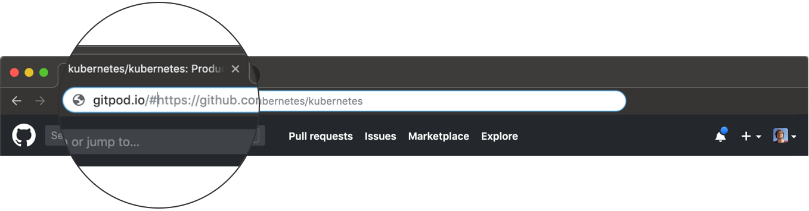

# Getting Started

Gitpod delivers the IDE part for the web-based development flows of common code hosting platforms.
The following example shows how to use Gitpod with a GitHub repository.

1. Point your browser to some GitHub repository, pull request, or issue, e.g.
    <a href="https://github.com/arunoda/learnnextjs-demo" target="_blank">https://github.com/arunoda/learnnextjs-demo</a>
2. Either prefix the URL in the address bar of your browser with `https://gitpod.io/#` (e.g.
   https://gitpod.io/#https://github.com/arunoda/learnnextjs-demo) or push the _Gitpod_ button if you
   have installed the [Gitpod extension](/docs/20_browser_extension/).

   

3. On first use you will have to authorize access to your GitHub account. This is necessary so you
   can access your data from within Gitpod.
4. Gitpod will now launch a workspace container for you in the cloud, containing a full Linux system.
   It will also clone the GitHub repository branch based on the GitHub page you were coming from.

Next up you should learn about [Gitpod's IDE](/docs/50_ide/).
