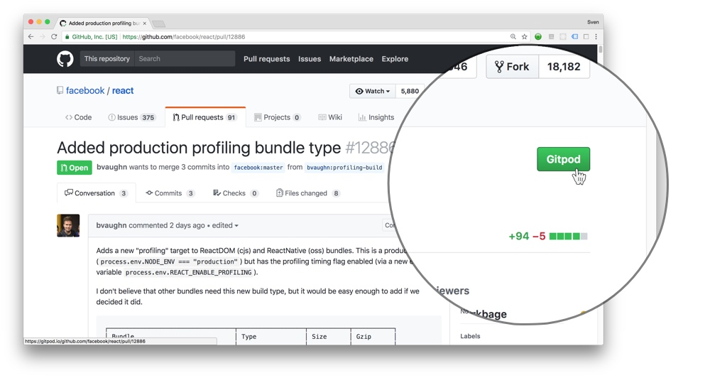

# Browser Extension

Creating a workspace is as easy as prefixing any GitHub URL with `gitpod.io/#`.

For convenience, we built the Gitpod browser extension. It adds a button to GitHub that does the
prefixing for you. Nothing more.

We provide the extension for
  - [Chrome](https://chrome.google.com/webstore/detail/gitpod-online-ide/dodmmooeoklaejobgleioelladacbeki)
    and
  - [Firefox](https://addons.mozilla.org/en-GB/firefox/addon/gitpod/).

