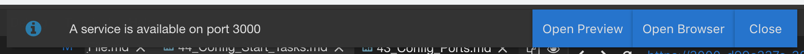
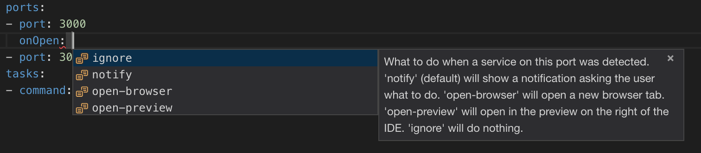

## Exposing Ports

If you want to access services running in your workspace, e.g. a development HTTP server on port `8080`,
you need to expose that port first. Gitpod has two means of doing that:
  1. On-the-fly: when you start a process which listens on a port in your workspace, Gitpod will ask you
     if you want to expose that port to the internet.
  2. In your configuration: if you already know that you want a particular port exposed, you can configure
     it in the `.gitpod.yml` file and skip the extra click later on. For example:

```yaml
ports:
  - port: 8080
```

Ports are mapped to their own URLs. In a workspace you can get the URL mapped to a port using `gp url <port>`. At the moment you can only expose
HTTP servers.

### Configure the Opening Behavior

When a newly started service gets detected, you usually get a notification telling you about it.
If it is not yet exposed, because it is not listed in the `.gitpod.yml`, the notification will allow you to expose the port.
If it is already exposed, either through the `.gitpod.yml` or by manually exposing it, the notification asks
whether and how to open it.



To change this behavior you can provide the property `onOpen`.
It has four possible values:

 - `notify` (default) - Show the notification.
 - `open-preview` - Open in the preview on the right.
 - `open-browser` - Open in a browser tab.
 - `ignore` - Don't do anything.

Any changes to the `.gitpod.yml` will have effect immediately.

 

