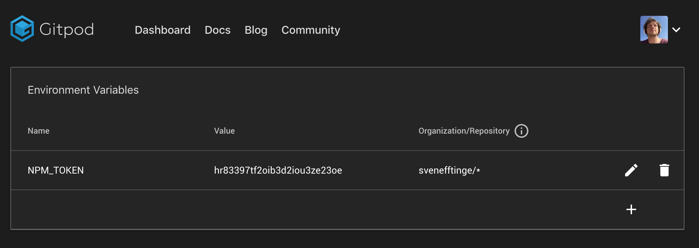

# Environment Variables

You can pass environment variables into your workspace.

## User-Specific Environment Variables

User-specific environment variables are stored in the user settings in an encrypted way. You can use this feature to set access tokens as environment variables as well
as passing other kind of values into your workspaces.

### Using the command line: `gp env`

The CLI can be used to print and modify the persistent environment variables associated with your user for the current repository.

To set the persistent environment variable `foo` to the value `bar` use:
```sh
gp env foo=bar
```

Beware that this does not modify your current terminal session, but rather persists this variable for the next workspace on this repository.
This command can only interact with environment variables for this repository. If you want to set that environment variable in your terminal,
you can do so using -e:
```sh
eval $(gp env -e foo=bar)
```

To update the current terminal session with the latest set of persistent environment variables,use:
```sh
eval $(gp env -e)
```

To delete a persistent environment variable use:
```sh
gp env -u foo
```

Note that you can delete/unset variables if their repository pattern matches the repository of this workspace exactly. I.e. you cannot
delete environment variables with a repository pattern of */foo, foo/* or */*.

```sh
Usage:
  gp env [flags]

Flags:
  -e, --export   produce a script that can be eval'ed in Bash
  -h, --help     help for env
  -u, --unset    deletes/unsets persisted environment variables
```

### Using the dashboard

You can also configure and view the environment variables in [your dashboard](https://gitpod.io/environment-variables/).



You can add as many environment variables as you wish. The repository pattern is used to filter on what workspaces the variables should be injected.
You can specify both the __orgname/reponame**, e.g. __microsoft/vscode__ in that case the variable will be only injected when starting workspaces for that repository.
To use a certain variable in more than one repo, e.g. in all of your repos or all forks of another you can use wildcards as well.

E.g. __*/theia-ide__ will inject in all forks of Theia, while __myorg/*__ will inject in all repos of a certain organization. __*/*__ will inject always.

> Please be aware that although the variable values are stored encrypted in our database, they are injected decrypted (readable). So be careful with sharing your live workspace. Snapshots on the other hand are save as they don't contain your environment variables.

# Passing Environment Variables

In addition to user-specific env variables, Gitpod also alows to pass in variables through the `gitpod.io/#` URL.
The syntax for that is
```
    https://gitpod.io/#var=value,var2=value2/https://github.com/my-org/repo-to-work-on
```

The values are [URL encoded](https://www.w3schools.com/tags/ref_urlencode.asp) to allow any non-ascii characters in values.
