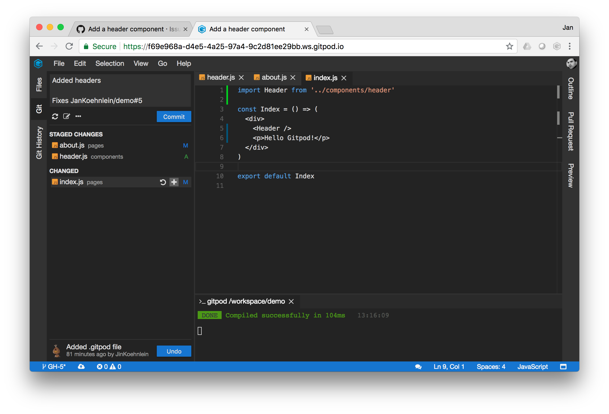

# Pull Requests

Gitpod lets you follow the standard GitHub flow. It does not require any detours or
additional steps.

In the GitHub flow, each programming task starts with a GitHub _issue_. In the issue you describe
the task, defect, or feature, and log all discussions and related commits.

To start a Gitpod workspace for an issue, either prefix the issue's URL in the address bar with
`https://gitpod.io/#` or click on the `Gitpod` button that comes with the [Gitpod browser
extension](20_Browser_Extension.md). Gitpod will start your cloud workspace in a new browser tab.

In the status bar in the lower left corner, you can see that Gitpod created a local branch `GH-{issue-number}`
(`GH-5` in this example) for your issue. If you open the `Git` view, you will notice that the commit message has
already been filled in as _Fixes..._. This causes GitHub to automatically close the issue once this commit is
merged.

Additionally, Gitpod has encountered a `.gitpod.yml` file in the repository and runs its
initialization task. In this example the initialization task builds and starts the app, so that it
can be tested right away in the `Preview` view.

Now solve the issue by applying a few changes. In this example, you add one file and modify two
existing ones. If you want to browse through all changes so far, go to the `Files` navigator view,
choose `Diff: Compare with...`, and select the `master` branch in the quick open menu. The `Diff`
view allows you to step through all the changes easily using the arrow keys.

Once you are done reviewing your changes, it is time to commit them. Go to the `Git` view and stage
all changed files by clicking on the `+` icon that pops up when you hover over the entries. Once
everything is staged, add a meaningful commit message and press the `Commit` button.

The next step in the GitHub flow is to propose your changes as a GitHub pull request. You can do that
from within Gitpod. In the `Pull Request` view you will see a message that your current
branch has no remote tracking branch. When you click on the `Publish Changes` button, Gitpod creates a
remote branch on GitHub and synchronizes it with your local branch.

The `Pull Request` view allows you to change title and description of the PR in Markdown (the
`Preview` tab shows the rendered version). You can also specify a different target branch to merge
into. If you are satisfied with all these values, click the `Create Pull Request` button. The pull
request is now pushed to GitHub.

The `Pull Request` view will now provide you with review facilities. You can view the PR on GitHub
or synchronize with out-of-band changes, change the target branch, view the conversation, or
start a review.

Now, leave a question to the reviewer. Open one of the modified files, hover over the gutter left
of the line numbers where you want to add the comment, and then click on the comment icon. Enter
your comment (once again in Markdown with `Preview` facilities) and click `Add single comment`.

Your comment should now appear in the `Conversation` view, and once it is synchronized with GitHub,
in the `Pull Request` view as well.

It looks like you are done here, so stop the workspace and ask a colleague to do a review.
Click on the avatar in the upper right corner and choose `Stop Workspace`. In the following dialog,
choose `Do It`.
