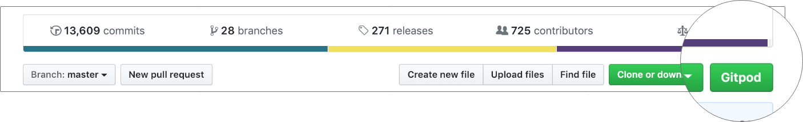

# Browser Extension

Creating a workspace is as easy as prefixing any GitHub URL with `gitpod.io/#`.

For convenience, we built the Gitpod browser extension. It adds a button to GitHub that does the
prefixing for you. Nothing more.

We provide the extension for
  - [Chrome](https://chrome.google.com/webstore/detail/gitpod-online-ide/dodmmooeoklaejobgleioelladacbeki)
  - [Firefox](https://addons.mozilla.org/en-GB/firefox/addon/gitpod/).

## Use with Gitpod Self-Hosted

If you are using Gitpod Self-Hosted you can still use the browser extension by configuring it with your self-hosted URL.

After you have installed the extension go to the options panel and enter your Gitpod Self-Hosted URL.

### Accessing the options on Chrome

A user can view an extension's options by right-clicking the extension icon in the toolbar then selecting options or by navigating to the extension management page at chrome://extensions, locating the desired extension, clicking Details, then selection the options link.

### Accessing the options on Firefox

An Options page enables you to define preferences for your extension that your users can change. Users can access the options page for an extension from the browser's add-ons manager.

## Source Code

Gitpod's browser extension is open source. You can check out its [source code](https://github.com/gitpod-io/browser-extension), or even open it in Gitpod:

