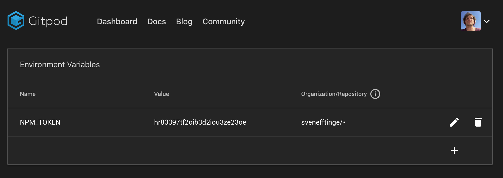

# Environment Variables

You can pass environment variables into your workspace.

## Default Environment Variables
The following environment variables are set automatically by Gitpod and are guaranteed to exist:

- `GITPOD_WORKSPACE_ID`: The Universally Unique Identifier (UUID) associated with the workspace.
- `GITPOD_WORKSPACE_URL`: The unique URL of the workspace.

### Reserved Prefix
Environment variables beginning with the prefix  `GITPOD_` are reserved for internal use by Gitpod and are overridden on every workspace startup. This means that a _user-defined_ variable set with the name `GITPOD_FOOBAR` will be ignored and not accessible in the workspace.

## User-Specific Environment Variables
Gitpod supports encrypted, user-specific environment variables.
They are stored as part of your user settings and can be used to set access tokens, or pass any other kind of user-specific information to your workspaces.

### Using the command line: `gp env`

The `gp` CLI print and modify the persistent environment variables associated with your user for the current repository.

To set the persistent environment variable `foo` to the value `bar` use:
```sh
gp env foo=bar
```

Beware that this does not modify your current terminal session, but rather persists this variable for the next workspace on this repository.
`gp` can only interact with the persistent environment variables for this repository, not the environment variables of your terminal.
If you want to set that environment variable in your terminal, you can do so using -e:
```sh
eval $(gp env -e foo=bar)
```

To update the current terminal session with the latest set of persistent environment variables, use:
```sh
eval $(gp env -e)
```

To delete a persistent environment variable use:
```sh
gp env -u foo
```

Note that you can delete/unset variables if their repository pattern matches the repository of this workspace exactly. I.e. you cannot
delete environment variables with a repository pattern of */foo, foo/* or */*.

```sh
Usage:
  gp env [flags]

Flags:
  -e, --export   produce a script that can be eval'ed in Bash
  -h, --help     help for env
  -u, --unset    deletes/unsets persisted environment variables
```

### Using the account settings

You can also configure and view the persistent environment variables in [your account settings](https://gitpod.io/environment-variables/).



You can add as many environment variables as you wish.

The repository pattern of each variable determines in what workspace it will be available.
Repository patterns follow the `repo/owner` pattern. You can use a wildcard on either of the two, e.g. `gitpod-io/*` would make that variable available in all repositories owned by `gitpod-io`.
Conversely `*/vscode` would make that variable available on all repositories called `vscode`; especially useful for forks.
Subsequently `*/*` makes that variable available everywhere.

> **Beware:** while the variable values are stored encrypted, they are available as plain text inside a workspace. Be careful when sharing your live workspace or when using `*/*` as repository pattern.

<br><br>

# Passing In Environment Variables

In addition to user-specific env variables, Gitpod also allows passing in variables through the `gitpod.io/#` URL.
The syntax for that is
```
https://gitpod.io/#var=value,var2=value2/https://github.com/my-org/repo-to-work-on
```

The values are <a href="https://www.w3schools.com/tags/ref_urlencode.asp" target="_blank">URL encoded</a> to allow any non-ascii characters in values.
In case of a conflict, e.g. in the example above if the user already had a variable `var2` set, the user's value would be used.
