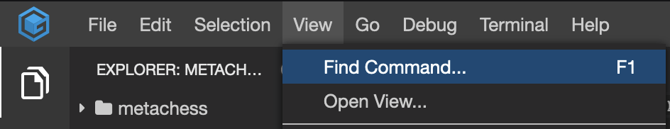
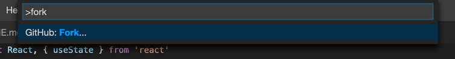
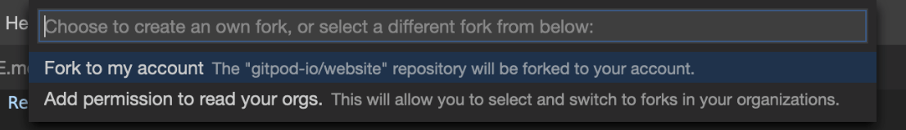

# Fork a Repository

Forking a repository in Gitpod is a simple 3 step process:

1 . Open the _command pallete_ by either pressing `F1` or selecting `View --> Find Command...` from the menu in the top left corner as shown:

2 . In the _command pallete_ type "fork" and click on the `Github: Fork...` option or press Enter.

3 . On selecting the `Github: Fork...` option you'll be presented with the following menu and from there you can select where to fork i.e to your account or an organization:

Once the repository is successfully forked you'll see a prompt in the bottom right corner of the screen:

