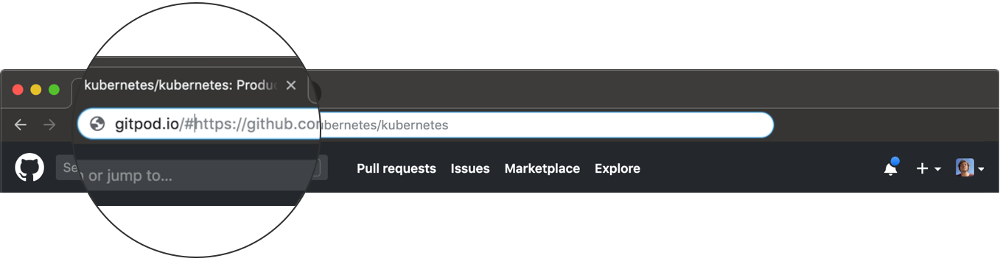

# Getting Started

Gitpod provides continuous dev environments for the development flows of common code hosting platforms.
The following example shows how to use Gitpod with a source code repository.

1. Point your browser to a GitLab, GitHub or Bitbucket repository, Pull/Merge Request, or issue, e.g.
    [https://gitlab.com/gitpod/spring-petclinic](https://gitlab.com/gitpod/spring-petclinic)
2. Either prefix the URL in the address bar of your browser with `gitpod.io/#` (e.g.
   https://gitpod.io/#https://gitlab.com/gitpod/spring-petclinic) or click the _Gitpod_ button if you've installed the [Gitpod browser extension](/docs/browser-extension/).

   

3. On first use you will have to authorize access to your GitLab, GitHub or Bitbucket account. This is necessary so you
   can access your data from within Gitpod.
4. Gitpod will now launch a workspace container for you in the cloud, containing a full Linux environment.
   It will also clone the repository, branch, or commit based on which code-hosting page you were coming from.

Next up you should learn about [Gitpod's IDE](/docs/ide/).
