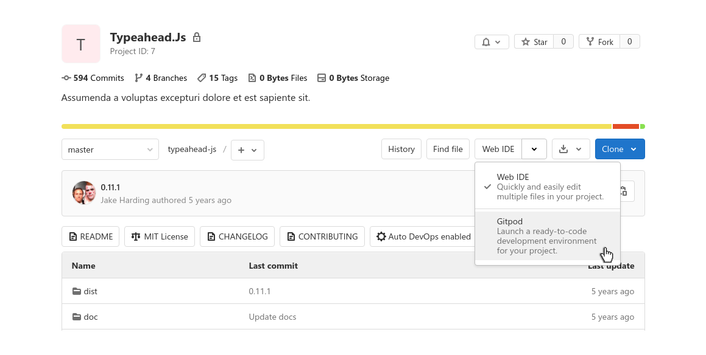

# Getting Started

Gitpod provides continuous dev environments for the development flows of common code hosting platforms.

You can start using Gitpod with one or more of the following ways:

- Enable [GitLab Integration](#gitlab-integration)
- Install [Browser Extension](#browser-extension)
- Use a [Prefixed URL](#prefixed-url)
- Quick start using an [Example Project](#example-project)

## GitLab Integration

GitLab comes with a native Gitpod integration. This feature is enabled on GitLab.com so you enable the GitLab integration in GitLab and choose to start a Gitpod workspace as an alternative to the GitLab Web IDE directly from GitLab.

[Learn more &rarr;](/docs/gitlab-integration/)

## Browser Extension

For convenience, we've made a browser extension that works with Google Chrome, Mozilla Firefox, and Safari. The extension adds a Gitpod button on every project across GitLab, GitHub, and Bitbucket so you can easily import any existing projects.

[Learn more &rarr;](/docs/browser-extension/)

## Prefixed URL

You can quickly open a new workspace for your project using a context URL like repository, branch, pull request, issue, or file. Just prefix the URL in the address bar of your browser with `gitpod.io/#`.

For example, try opening [https://gitpod.io/#https://gitlab.com/gitpod/spring-petclinic](https://gitpod.io/#https://gitlab.com/gitpod/spring-petclinic) or [https://gitlab.com/gitpod/spring-petclinic/-/merge_requests/2](https://gitlab.com/gitpod/spring-petclinic/-/merge_requests/2).

[Learn more &rarr;](/docs/context-urls/)

## Example Project

We've alrelay added Gitpod configuration for some example or existing projects.

You can pick any of the example projects listed under [Languages & Frameworks](https://www.gitpod.io/docs/languages-and-frameworks/).

For example, try opening [Vuepress](https://gitpod.io/#https://github.com/vuejs/vuepress) or a [Java with Spring Boot](https://gitpod.io/#https://github.com/gitpod-io/spring-petclinic) example.
