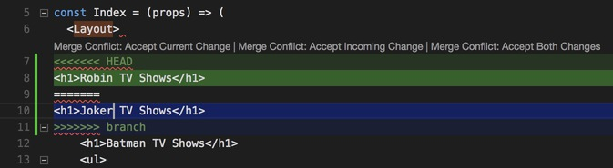

# Git Integration

Theia integrates closely with Git by offering convenient UIs on top of the command line `git`
(which is available in the terminal as well).

- [Authoring Commits](#authoring-commits)
- [Git Status Bar](#git-status-bar)
- [Branches and Tags](#branches-and-tags)
- [Gutter Indicators](#gutter-indicators)
- [Blame Annotations](#blame-annotations)
- [Merge Conflicts](#merge-conflicts)
- [Viewing Diffs](#viewing-diffs)
- [Git History](#git-history)

## Authoring Commits

The Git view is automatically added to the left panel. If you have accidentally closed it, you can
reopen it from the `View` > `Git` menu or with the <kbd>Ctrl+Shift+G</kbd> (<kbd>⌘+Shift+G</kbd>
on macOS) key binding.

The `Git` view consists of three major sections. The top section is for authoring the commit messages.
It also provides access to a couple of basic Git commands.

Right below is the commit section, which lists the changed files by their name and separates them in two
groups: the `STAGED CHANGES` and `CHANGED`. The latter shows all unstaged changes.

At the bottom of the `Git` view, a small section gives a quick insight into the most recent commit.

In the list of staged and unstaged changes, the file names are followed by the path to their
parent directory and an indicator describing the type of the change. This can be:

- `A`: Added (new staged),
- `U`: new Unstaged,
- `R`: Renamed,
- `C`: Copied (blue), Conflicted (red),
- `M`: Modified, and
- `D`: Deleted.

An unstaged change can be reverted by clicking on the `Discard Changes` action next to the file
location. Double-clicking on a modified file will open it in a diff editor. The read-only editor on
the left-hand side shows the state from the index. The right-hand side of the editor reflects the
state of the working tree, and it lets you to further modify the file. New and deleted files do not
open in a diff editor. Files can be staged (added to the index) by clicking on the `Stage Changes` action (`+` sign). To unstage changes, use `Unstage Changes` action (`-` sign).

After staging the desired files and specifying the commit message, the changes can be committed to
the repository. After a successful commit, the `Last Commit` section is automatically updated.

## Git Status Bar

In the bottom left corner of Theia you can find indicators describing the status of your Git repository.
It shows the current branch, dirty indicators, and the number of ahead and behind changes of the
current branch.

The dirty indicators are as follows:

- `*`: You have unstaged changes in your branch.
- `+`: You have staged changes in your branch, but no unstaged.
- `!`: You have conflicting changes in your branch.

By clicking on the branch name, you can perform a `git checkout`. This operation is equivalent to
the `Git: Checkout` command from the command palette.

There is a `Synchronize Changes` action as well in the status bar, next to the branch indicator, if
the currently checked-out branch has an upstream branch configured. `Synchronize Changes` will pull
remote changes to your local repository and then push local commits to the upstream branch.

## Branches and Tags

You can create and check out branches directly within Theia through the `Git: Checkout` command in
the command palette. For creating a new branch, select the first item from the list, `Create new branch...`, and specify the desired name of your branch. Theia creates the new branch for you and
checks it out.

## Gutter Indicators

If you open a file that is under version control by Git and start applying changes,
Theia will add annotations to the gutter and to the overview ruler of the editor:

- A red triangle indicates where lines have been deleted.
- A green bar shows the newly added lines.
- A blue bar indicates modified lines.

## Blame Annotations

You can show the blame annotation by either selecting the `Show Blame Annotations` from the editor's
context menu or by picking `Git: Show Blame Annotations` from the command palette. This will show
the blame annotations on the left hand-side of the editor. Press <kbd>Esc</kbd> if you want to hide
the blame annotations.

## Merge Conflicts

Theia recognizes merge conflicts. Theia highlights the differences and provides inline action to
accept either the local or the incoming change. Alternatively, both modifications can be accepted at
the same time. Once you have resolved the conflicts, stage your changes and commit them.

## Viewing Diffs

The Git extension supports diffing within Theia. Selecting any of the modified files will open a
diff viewer. Its left-hand side is a read-only editor showing the index state, and the right-hand
side is an editor for the working-tree state.

## Git History

Theia provides various ways to review the Git history.

- The history of an individual file can be checked, or
- The history of multiple files within a directory can be reviewed at once.

You can activate the `Git History` view by right-clicking on the file in the `Files` navigator and
selecting the `Git History` context menu item. Alternatively, you can open the history view from the
`View` > `Git History` menu or toggle the view with the <kbd>Alt+H</kbd> command. The content of the
`Git History` view does not update when changing the active editor or when altering the selection in
the `Files` view. To get the history of an individual resource you have to either use the `Git History` command from the command palette or from the `Files` navigator's context menu.

The top of the `Git History` view shows the path of the resource or resources. Right below the path,
you can see the list of commits with some details such as the committer, the subject of the commit
message, and the relative time of the commit. You can open up the commit in a read-only editor to
review all the details about the commit.

