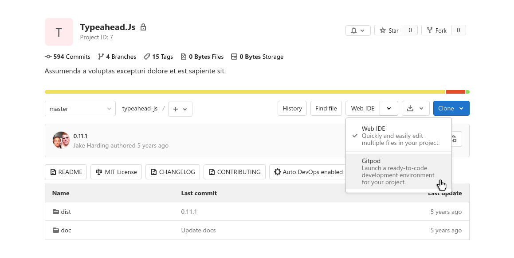

# GitLab Integration

GitLab comes with a [native Gitpod integration](https://docs.gitlab.com/ce/integration/gitpod.html). This feature is enabled on GitLab.com by default, but needs to be enabled by the administrator of a GitLab self-managed instance as described in the [GitLab docs](https://docs.gitlab.com/ce/integration/gitpod.html).

## Starting Workspaces

When the Gitpod integration is enabled in GitLab, users can choose to start a Gitpod workspace as an alternative to the GitLab Web IDE directly from GitLab. Simply click on the dropdown arrow next to the `Web IDE` split button on the project or merge request page, and choose “Gitpod”. The Gitpod workspace will open in a new browser tab. Then, the next time you visit a GitLab page, the last used action will be pre-selected.

To launch new Gitpod workspaces for issues, branches, specific commits, etc. you can also prefix any GitLab URL with `gitpod.io/#` as described in the [Getting Started](/docs/getting-started) page, or use the [browser extension](/docs/browser-extension/) to add a convenient Gitpod button to every GitLab page.

## Enabling Prebuilds

To enable [prebuilt workspaces](/docs/prebuilds/) for your GitLab project you need to grant `allow api calls` in Gitpod's [Access Control](/access-control/) page. This allows Gitpod to install a webhook. The webhook creates a new prebuild for every push event.

The webhook will be automatically installed when you trigger the first prebuild manually. For this, prefix your GitLab project URL with `gitpod.io/#prebuild/` as described in the [prebuilds page](/docs/prebuilds/#on-gitlab-and-bitbucket).
