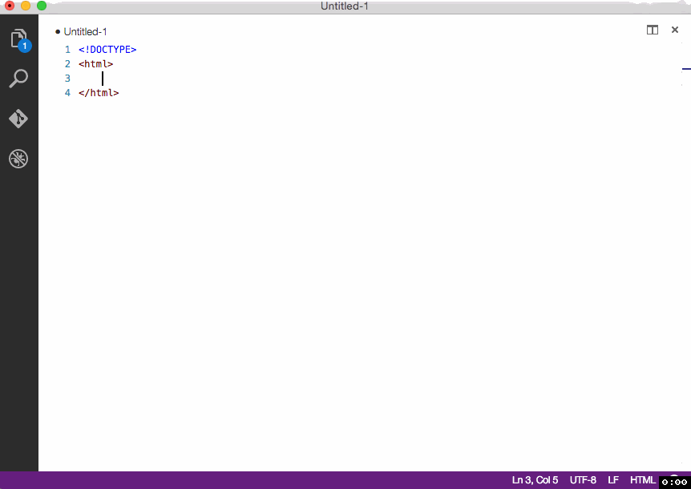
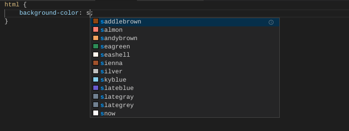

# HTML

Looking to try web development in Gitpod? Well you're in luck: Gitpod was made with web development in mind. And, depending on your needs, you may want to customize this experience further!

## Workspace Configuration

### VSCode Extensions

#### [HTML-Snippets](https://marketplace.visualstudio.com/items?itemName=abusaidm.html-snippets)
This extension adds many useful snippets for productivity. See for yourself:



To add this extension to your repository add the following to your [`.gitpod.yml`](https://www.gitpod.io/docs/config-gitpod-file/) file

```yaml
vscode:
  extensions:
    - abusaidm.html-snippets@0.2.1:7b7Vkkp6Lem9WOqKCYMq2w==
```
#### [HTML CSS Support](https://marketplace.visualstudio.com/items?itemName=ecmel.vscode-html-css)
This will add great auto-completion for your project, including color-completion!



To add this extension to your repository add the following to your [`.gitpod.yml`](https://www.gitpod.io/docs/config-gitpod-file/) file
```yaml
vscode:
  extensions:
    - ecmel.vscode-html-css@0.2.3:RBTpzQbz8rn5KTlc82tnsQ==
```
### Try It!

Want to try it out? And see a minimal example in action? Great, then you can open this in Gitpod:

[](https://gitpod.io/#https://github.com/JesterOrNot/Gitpod-Web-Development-Example)
