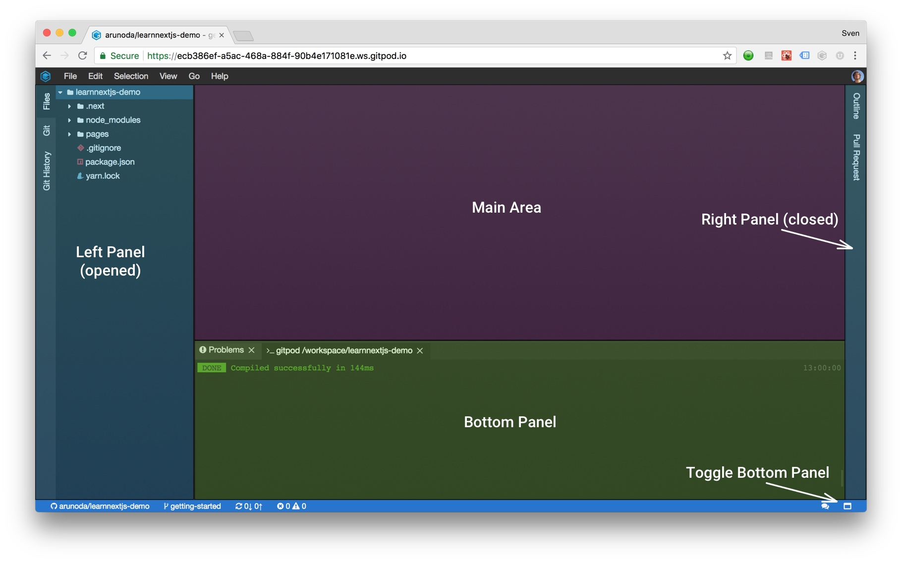

# Theia – Gitpod's IDE

The IDE in Gitpod is based on the open-source project [Theia](https://theia-ide.org). It is hosted
and developed under the umbrella of the Eclipse Foundation, which ensures vendor neutrality and
emphasizes diversity.

  * [Overview](#overview)
  * [Tips & Tricks](/docs/tips-and-tricks/)
  * [Git Integration](/docs/git/)
  * [Search](/docs/search/)
  * [Pull Requests](/docs/pull-requests/)
  * [Code Reviews](/docs/code-reviews/)

## Overview

When you open Theia for the first time, a welcome screen is shown to quickly get you started. After
closing it you will see the workbench shell. Depending on the
[context URL](/docs/context-urls/), different views might be opened.

Let us have a look at the primary elements of the workbench shell.

### Views and Editors

A Theia workbench shell consists of any number of opened views and editors. Views and editors can be
freely arranged by dragging and dropping them around.

### Main Area and Panels

Within the main area, the drag-and-drop functionality allows for splitting freely as you will. Also
widgets can be moved to the side or bottom panels.

## Theia vs VSCode

While Theia may look a lot like VSCode, it isn't VSCode, rather a different IDE following the same design scheme.
