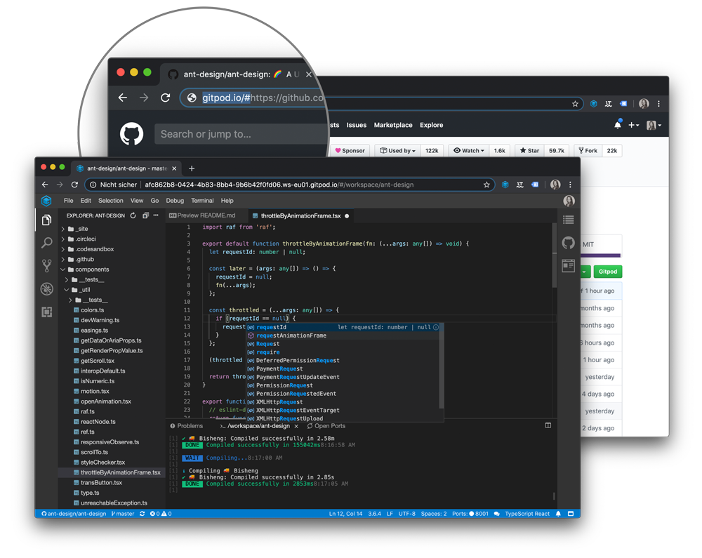

# Introduction

[Gitpod](https://www.gitpod.io) is frictionless coding.

Whether you just want to hack, have code to review or feel like trying something new on
GitLab, GitHub, or Bitbucket, Gitpod launches a prebuilt dev environment with a single click.

Because Gitpod is based on open-source tech like VS Code, Docker, and Kubernetes, it is familiar,
comprehensive, extensible, and easy to use. With deep code-hosting platform integrations, tools for
sharing and collaborating, and a focus on usability, Gitpod contains your entire dev workflow in a
browser tab.

Unlike traditional cloud and desktop IDEs, Gitpod understands the context and adjusts the
IDE automatically. For example, if you create a Gitpod workspace from a Pull or Merge Request,
Gitpod will open the IDE in code-review mode.

Also, Gitpod workspaces are meant to be disposable. That is, you don't need to maintain a single workspace
to prevent it from becoming outdated.
Workspaces are created when you need them, and you can forget about them when you are done. Simply go to
GitLab, GitHub, or Bitbucket and create a fresh workspace whenever you need one.

The IDE itself is open-source and based on [Eclipse Theia](/docs/ide/). Theia is highly extensible and
builds upon mature technologies such as TypeScript, VS Code, Webpack, and Node.js.

This site provides all the details on how to use Gitpod and Theia. If you have questions
or want discuss something, please join the
<a href="https://community.gitpod.io/" target="_blank">Gitpod community</a>.

## Architecture

Gitpod.io runs in multiple Kubernetes clusters hosted on Google Cloud infrastructure in three different regions:

When starting a workspace, Gitpod will automatically pick the cluster that is closest to your location and
start a Kubernetes pod in it. The requested git repository gets cloned and the branch you need is checked out.
Furthermore, Gitpod runs any scripts that are configured for that git repository state.

Learn more about how to configure your repository [here](/docs/configuration/).
