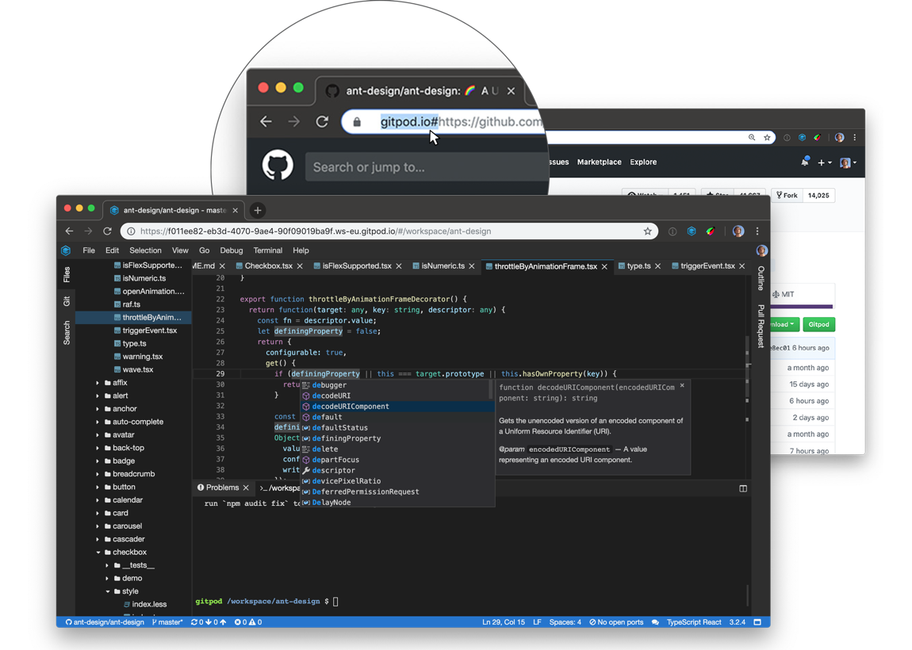
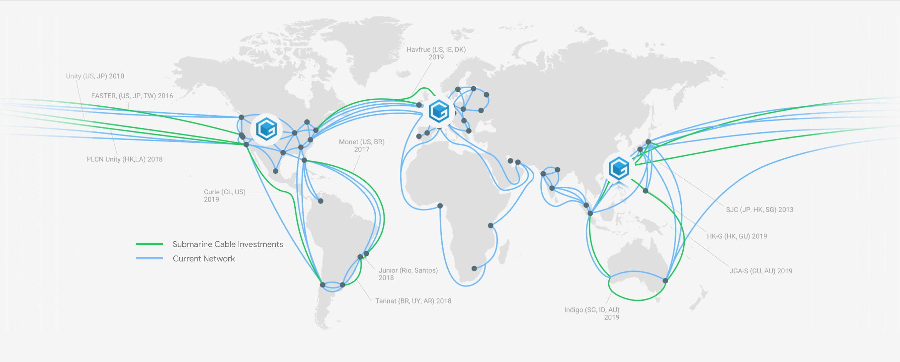

# Introduction

[Gitpod](https://www.gitpod.io) is frictionless coding.

Whether you just want to hack, have code to review or feel like trying something new on
GitHub, Gitpod beams you right into a ready-to-code dev environment with a single click.

Because Gitpod is based on OSS tech like VS Code, Docker and Kubernetes, it is familiar,
comprehensive, extensible, and easy to use. With deep GitHub integration, tools for
sharing, and a focus on usability, Gitpod contains your entire dev workflow in a
browser tab.

Unlike traditional cloud and desktop IDEs, Gitpod understands the context and prepares the
IDE automatically. For instance, if you are creating a Gitpod workspace from a GitHub pull request,
the IDE will open in code-review mode.

Also, Gitpod workspaces are meant to be disposable. That is, you do not need to maintain anything.
They are created when you need them, and you can forget about them when you are done. Simply go to
GitHub and create a fresh workspace whenever you need one.

The IDE is open-source and based on [Eclipse Theia](50_IDE.md). Theia is highly extensible and
builds upon mature technologies such as TypeScript, VS Code, Webpack, and Node.js.

This site provides all the details on how to use Gitpod and Theia. If you have questions
or want discuss something, please join the [Gitpod community on Spectrum](https://spectrum.chat/gitpod).

## Architecture

Gitpod.io runs in multiple Kubernetes clusters hosted on Google Cloud infrastructure in three different regions:

When starting a workspace, Gitpod will automatically pick the cluster that is closest to your location and
start a Kubernetes pod in it. The requested git repository gets cloned and the branch you need is checked out.
Furthermore, Gitpod runs any scripts that are configured for that git repository state.

Learn more about how to configure your GitHub repository [here](40_Configuration.md).
