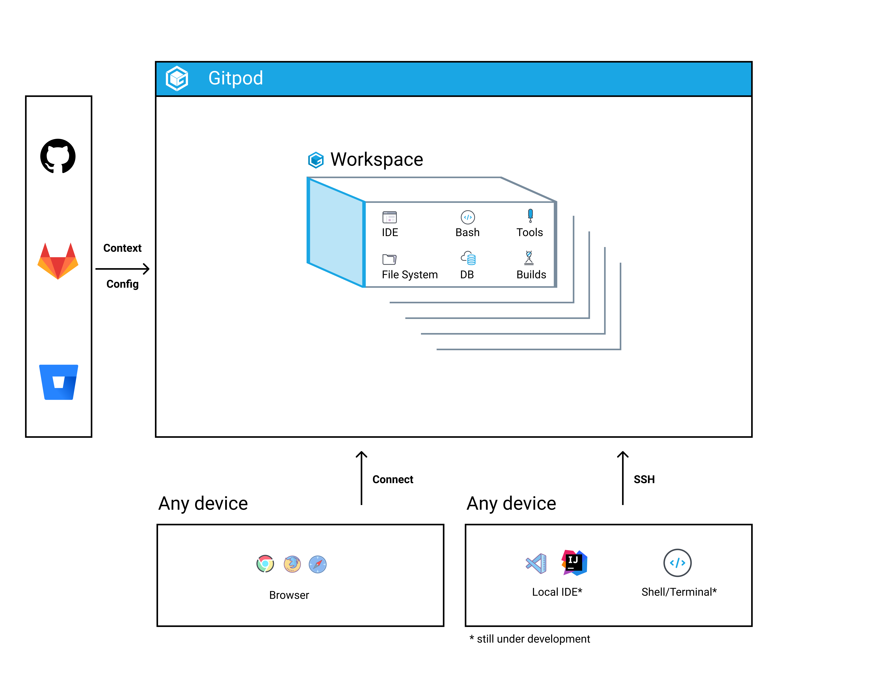

# Introduction to Gitpod

[Gitpod](https://www.gitpod.io) is an open source platform for automated and **ready-to-code development environments** that blends into your existing workflow. It enables developers to describe their dev environment as code and **start instant and fresh development environments for each new task** directly from your browser.

### Gitpod does to Dev Environments what Docker did to Servers 🐳

Today we are emotionally attached (for better or worse) to our dev environments, give them names & massage them over time. They are pets - similar to servers before docker took advantage of `namespaces` and `cgroups` in Linux and turned these nice puppies into cattle.

With Gitpod it is the same - we treat dev environments as automated resources you can spin up when you need them and close down (and forget about) when you are done with your task. Dev environments become fully automated and ephemeral. Only then you are **always ready-to-code** - immediately creative, immediately productive with the click of a button and without any friction.

This is what is at the heart of Gitpod: **an open platform that removes all friction of manually setting up and maintaining dev environments** allowing yourself and your team to build applications quicker and more collaboratively.

`youtube: d6D-OUPnJeg`

`youtube: QV1fYt-7SLU`

### Gitpod Concepts

Gitpod seamlessly integrates in your workflow and works with all major git hosting platforms including GitHub, GitLab and Bitbucket. It understands the context you are in and adjusts your dev environment accordingly. For example, if you create a Gitpod workspace from a Pull or Merge Request, Gitpod will open a fully-initialized dev environment in code-review mode.

At its core Gitpod relies on a **client-server architecture** where the client can either be:

- **Any device** with a browser and internet connection (Gitpod works with Chrome, Firefox, Safari, Edge and other Chromium-based browsers)
- Your **local machine** via local VS Code, IntelliJ or simply your shell/terminal where you SSH into your Gitpod workspace (*expected to be released in early Q1/2021*)

Server-side Gitpod is a Kubernetes application that understands the context from GitLab, GitHub and Bitbucket and spins up containerized dev environments. Under the hood is a **customizable Linux container**, which we call your *workspace*.

####  🗳 Workspace

A workspace comprises your whole development environment and gives you similar capabilities to a Linux machine. Compared to the latter it is however **pre-configured and optimized for your individual development workflow**. Each workspace includes:

- Your source code
- A shell with [root / sudo capabilities](https://www.gitpod.io/blog/root-docker-and-vscode/#root-access)
- Your IDE of choice* - currently this is [VS Code](https://www.gitpod.io/blog/root-docker-and-vscode/#vs-code) or [Theia](https://theia-ide.org/)
- Your personal IDE extensions, themes, editor prefs
- Full [Docker support](https://www.gitpod.io/blog/root-docker-and-vscode/#docker)

**Jetbrain's IDEs, Jupyter Notebook, Jupyter Labs are already available in [private beta](https://www.gitpod.io/contact/).*

#### 🏗 Dev-environments-as-code

Spinning up dev environments is easily repeatable and reproducible, because Gitpod applies lessons learned from infrastructure-as-code allowing you to **automate, version-control and share dev environments across your team**. We call this [dev-environments-as-code](https://www.gitpod.io/blog/dev-env-as-code/).

To reap the resulting automation benefits you provide a then versioned configuration file `.gitpod.yml`  in the root of your git repository. The `.gitpod.yml` contains everything that describes your dev environment:

- A Docker image or file as the base to run your workspace in.
- Commands executed before workspace  startup (see [Prebuilds](#prebuilds)).
- Commands executed on workspace startup.
- Ports to expose on dev workspace startup.
- and [more](https://www.gitpod.io/blog/gitpodify/).

Learn more about how to configure your repository [here](https://www.gitpod.io/docs/configuration/).

#### ⚡️ Prebuilds {#prebuilds}

Gitpod continuously builds *all* your git branches like a CI server. Whenever your code changes (e.g. when new commits are pushed to your repository), Gitpod can prebuild workspaces, i.e. run the `init` commands in your `.gitpod.yml` before you even start a workspace.

Then, when you do create a new workspace on a branch, or Pull/Merge Request, for which a prebuild exists, this workspace will load much faster, because all dependencies will have been already downloaded ahead of time and your code will be already compiled.

Only with [prebuilds enabled](https://www.gitpod.io/docs/prebuilds/#enable-prebuilt-workspaces) your dev environment can turn fully ephemeral.

More on [prebuilds](https://www.gitpod.io/docs/prebuilds/).

### Next Steps

With Gitpod you start treating your dev environments as something ephemeral: you start them, you code, you push your code, and you forget about them. For your next task, you'll use a fresh dev environment.

- Read about [Getting started with Gitpod](/docs/getting-started/)
- Get hands on experience by [gitpodifying your first project](https://www.gitpod.io/docs/configuration/) 🛠
