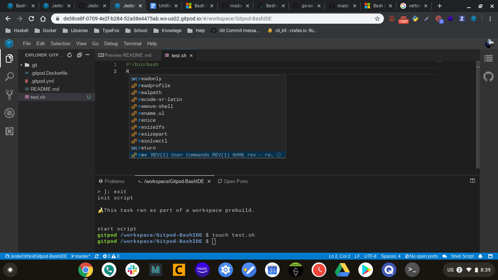

# Bash in Gitpod

Bash is the default shell for Gitpod. However, if you're developing a Bash script yourself, you may want to configure additional language support.

## Example Repositories

Here are a few Bash example projects that are already automated with Gitpod:

<div class="table-container">

| Repository | Description | Try It |
|------------|--------------|--------|
|[inlets/inlets](https://github.com/inlets/inlets) | Reverse proxy and service tunnel | [](https://gitpod.io/#https://github.com/inlets/inlets)

</div>

## VSCode Extensions

### ShellCheck

ShellCheck provides linting for common mistakes in your shell script.

To use ShellCheck in Gitpod, first, we must install the `shellcheck` tool. Here is a simple Dockerfile to get you started:

```Dockerfile
FROM gitpod/workspace-full

USER gitpod

RUN brew install shellcheck
```

You should also install the shellcheck VS Code extension in Gitpod, by adding a [.gitpod.yml](/docs/config-gitpod-file/) configuration file to your repository that looks like this (notice the `vscode` extensions section):

```yaml
image:
  file: .gitpod.Dockerfile

vscode:
  extensions:
    - timonwong.shellcheck@0.9.0:hsU/Rd39aqPYowTqL+DbXg==
```

Not sure about ShellCheck? Try it in Gitpod!

[](https://gitpod.io/#https://github.com/gitpod-io/Gitpod-ShellCheck)

### Bash IDE



Just to name a few things Bash IDE adds: Code completion, hovers, and diagnostic reporting.

To install Bash IDE to your repository add the following to your [.gitpod.Dockerfile](/docs/config-docker/)

```dockerfile
RUN npm i -g bash-language-server
```

Also the following in your
[.gitpod.yml](/docs/config-gitpod-file/)

```yaml
vscode:
  extensions:
    - mads-hartmann.bash-ide-vscode@1.4.0:/qx+rdXE/fGTGWhelNf3aQ==
```

Not sure about Bash IDE? Try it in Gitpod

[](https://gitpod.io/#https://github.com/gitpod-io/Gitpod-BashIDE)

## Further Reading

- For more information about ShellCheck please see [shellcheck.net](https://shellcheck.net)


## Known issues

### The shellcheck program was not found
[It has been reported](https://github.com/gitpod-io/gitpod/issues/1461#issuecomment-621232166) that shellcheck extension fails to detect shellcheck from homebrew which results in:


To resolve this you need to set `"shellcheck.executablePath": "/home/linuxbrew/.linuxbrew/bin/shellcheck",` (or to path that point to shellcheck on your system), See https://github.com/vivek-verma202/GWAS_FM/pull/3/files
