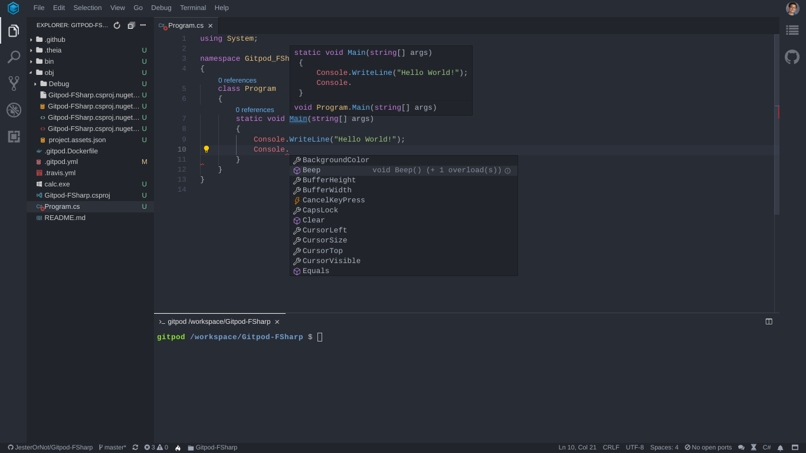
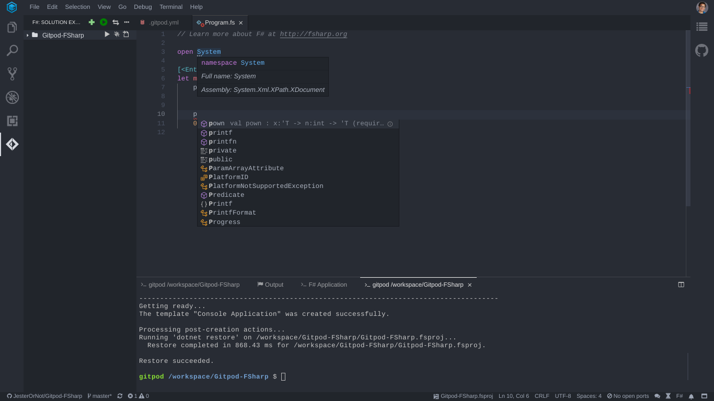

# .NET in Gitpod

## Example Repositories


<div class="table-container">

| Repository | Description | Try it |
|------|----------------|-----------|
|[uno](https://github.com/unoplatform/uno)|Build Mobile, Desktop and WebAssembly apps with C# and XAML|[](https://gitpod.io/#https://github.com/unoplatform/uno)
|[coolstore-microservices](https://github.com/vietnam-devs/coolstore-microservices)|A Kubernetes-based microservices application on service mesh written in C#|[](https://gitpod.io/#https://github.com/vietnam-devs/coolstore-microservices)|
|[uno.quickstart](https://github.com/unoplatform/uno.quickstart)|An Uno "Hello world!" project using Windows UWP, iOS, Android and WebAssembly|[](https://gitpod.io/#https://github.com/unoplatform/uno.quickstart)|
|[Fable](https://github.com/fable-compiler/Fable)|F# to JavaScript Compiler written in F#|[](https://gitpod.io/#https://github.com/fable-compiler/Fable)|

</div>

## Installing the .NET Tools

To get all the .NET tools that you need pre-installed in your Gitpod workspaces, use the following base image in your [.gitpod.yml](https://www.gitpod.io/docs/config-gitpod-file/):
```YAML
image: gitpod/workspace-dotnet
```

If your project requires a GUI or Virtual Desktop, please use this image instead:
```YAML
image: gitpod/workspace-dotnet-vnc
```
This will give you a full GUI Virtual Desktop for your .NET application! The Virtual Desktop will be running on port `6080`.

## Compiling .NET Code in Gitpod

To compile your **C#** Code in Gitpod, run `mono-csc <FILE>`,  where `<FILE>` is the path to the C# program you want to compile.

To compile your **F#** Code in Gitpod, run `fsharpc <FILE>`,  where `<FILE>` is the path to the F# program you want to compile.


## Running *.EXE files in Gitpod
To run your code after it has been compiled run `mono <FILE>` where `<FILE>` is the path to the EXE file you want to run

## Useful VSCode Extensions

### <p>The C# Extension</p>



This extension brings code completion, snippets, auto-formatting, peek definition, refactoring, and hover documentation for C#! To install this extension for your repository, add the following to your [.gitpod.yml](https://www.gitpod.io/docs/config-gitpod-file/) file:

```yaml
vscode:
  extensions:
    - ms-vscode.csharp@1.21.12:kw8SkO8+aVTSFug281WfQQ==
```

### Ionide-fsharp



Ionide-fsharp gives F# developers the following features:

* A Widget for your F# needs
* Auto completion
* Shows errors inline
* Quickfix
* Goto definition
* Peek definition

To add this extension to your repository, add the following to your [.gitpod.yml](https://www.gitpod.io/docs/config-gitpod-file/):

```yaml
vscode:
  extensions:
    - Ionide.Ionide-fsharp@4.6.2:yBkAE6j7z7gJ5WEcyMjEOg==
```
