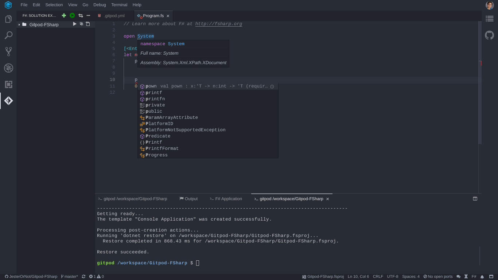

# .NET in Gitpod

## Example Repositories


<div class="table-container">

| Repository | Description | Try it |
|------|----------------|-----------|
|[dotnetcore](https://github.com/gitpod-io/dotnetcore)|C# .NET Core template|[](https://gitpod.io/#https://github.com/gitpod-io/dotnetcore)|
|[uno](https://github.com/unoplatform/uno)|Build Mobile, Desktop and WebAssembly apps with C# and XAML|[](https://gitpod.io/#https://github.com/unoplatform/uno)|
|[uno.quickstart](https://github.com/unoplatform/uno.quickstart)|An Uno "Hello world!" project using Windows UWP, iOS, Android and WebAssembly|[](https://gitpod.io/#https://github.com/unoplatform/uno.quickstart)|

</div>

## Installing the .NET Tools

To get all the .NET tools that you need pre-installed in your Gitpod workspaces, use the following base image in your [.gitpod.yml](https://www.gitpod.io/docs/config-gitpod-file/):
```YAML
image: gitpod/workspace-dotnet
```

If your project requires a GUI or Virtual Desktop, please use this image instead:
```YAML
image: gitpod/workspace-dotnet-vnc
```
This will give you a full GUI Virtual Desktop for your .NET application! The Virtual Desktop will be running on port `6080`.

## Compiling .NET Code in Gitpod

To compile your **C#** or **F#** Code in Gitpod, run `dotnet build <FILE>`, where `<FILE>` is the path to the C# or F# project file or .NET solution file you want to compile.

## Running .NET Code in Gitpod

To run your code after it has been compiled run `dotnet <FILE>` where `<FILE>` is the path to the EXE file you want to run. You can also run application with `dotnet run <FILE>` where `<FILE>` is the path to the C# or F# project file you want to compile and run.

## Running .NET Code in watch-mode

Alternatively, you can also run your application in so-called watch-mode. In such configuration the application will recompile and rerun itself every time you save any source file belonging to the project. To run your code in watch-mode use `dotnet watch --project <FILE> run` where `<FILE>` is the path to the C# or F# project file you want to compile and run.

## Useful VSCode Extensions

### <p>The C# Extension</p>


This extension brings code completion, snippets, auto-formatting, peek definition, refactoring, and hover documentation for C#!

To install this extension for your repository, open the **Extensions** panel in Gitpod (left vertical IDE menu), then search for "csharp" and install it "for this project". Next, commit the [.gitpod.yml](https://www.gitpod.io/docs/config-gitpod-file/) file that was automatically created (or updated) by Gitpod.

### Ionide-fsharp



[Ionide-fsharp](https://ionide.io/) gives F# developers the following features:

* A Widget for your F# needs
* Auto completion
* Shows errors inline
* Quickfix
* Goto definition
* Peek definition
* And more...

To add this extension to your repository, add the following to your [.gitpod.yml](https://www.gitpod.io/docs/config-gitpod-file/):

```yaml
vscode:
  extensions:
    - Ionide.Ionide-fsharp@4.6.2:yBkAE6j7z7gJ5WEcyMjEOg==
```
