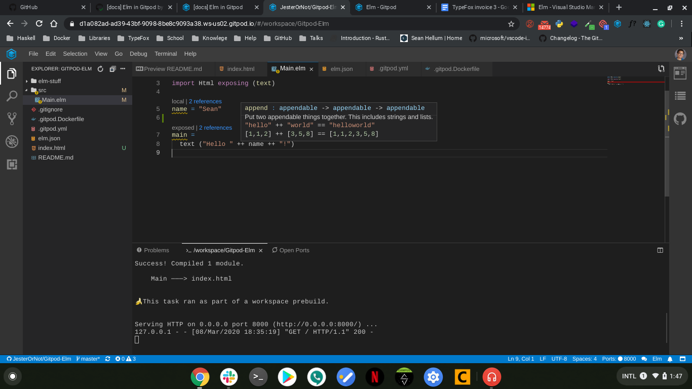

# Elm in Gitpod

It's easy to set up Elm in Gitpod.

## Setting up the Dockerfile

Add a Dockerfile to your project as [.gitpod.Dockerfile](https://www.gitpod.io/docs/config-docker/):

```Dockerfile
# Install Elm
RUN curl -L -o elm.gz https://github.com/elm/compiler/releases/download/0.19.1/binary-for-linux-64-bit.gz \
    && gunzip elm.gz \
    && chmod +x elm \
    && sudo mv elm /usr/local/bin/

# Formats Elm code according to a standard set of rules based on the official Elm Style Guide
RUN npm install -g elm-format

# Unit and fuzz tests for Elm code.
RUN npm install -g elm-test

# Analyse your Elm code, identify deficiencies and apply best practices.
RUN npm install -g elm-analyse
```


## Example Repositories

Here are a few Elm example projects that are already automated with Gitpod:

<div class="table-container">

| Repository | Description | Try It |
|------------|--------------|--------|
|[elm-spa-example](https://github.com/svenefftinge/elm-spa-example) | A Single Page Application written in Elm | [](https://gitpod.io/#https://github.com/svenefftinge/elm-spa-example) 

</div>

## VSCode Extensions

### Elm



This extension adds many features:

- Peek/Goto definition
- [Intellisense](https://code.visualstudio.com/docs/editor/intellisense)/Code completion
- Hover documentation
- Autoformatting
- Rename symbols

To add this VSCode extension to your repository please add the following to your [.gitpod.yml](https://www.gitpod.io/docs/config-gitpod-file/) file

```yaml
vscode:
  extensions:
    - elmTooling.elm-ls-vscode@0.8.0:rb3k4mPelyC4Fqod9UBvvA==
```
