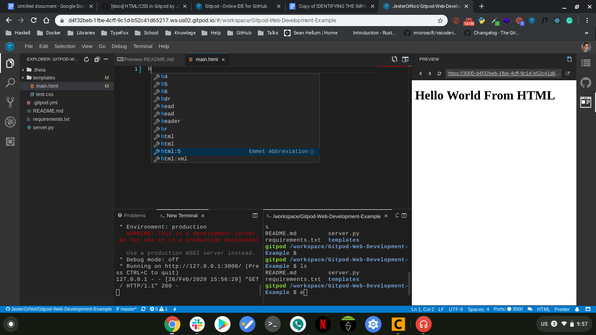
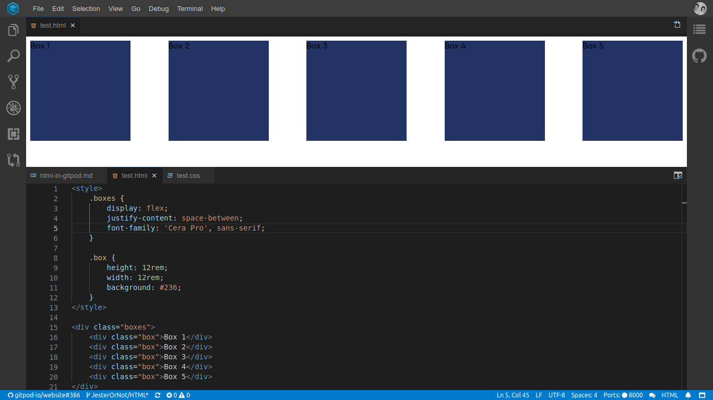

# HTML & CSS in Gitpod

 Gitpod has great HTML and CSS support. In fact, Gitpod was made with web development in mind. And, depending on your needs, you may want to customize this experience further!

## Example Repositories

Here are a few HTML/CSS example projects that are already automated with Gitpod:

Repository | Description | Try it
---|---|---
[Front-End-Checklist](https://github.com/thedaviddias/Front-End-Checklist) | The perfect Front-End Checklist for modern websites and meticulous developers | 
[Devhints](https://github.com/rstacruz/cheatsheets) | TL;DR for developer documentation - a ridiculous collection of cheatsheets | 

## [emmet](http://emmet.io/) Support

Gitpod comes with [emmet](http://emmet.io/) support right out of the box giving you access to powerful snippets and completions

## Live Preview

With Gitpod you can open a preview for Markdown and HTML files while you are coding.

To open the preview for a file, click the `Open Preview to the Side` icon in the upper right-hand corner:

## Try It!

Want to try it out? And see a minimal example in action? Great, then you can open this in Gitpod:

