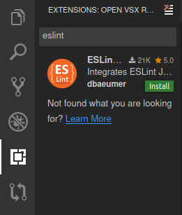

# JavaScript in Gitpod

Gitpod comes with great built-in support for JavaScript, TypeScript, and tools like Node.js, npm, and Yarn pre-installed. Still, depending on your project, you might want to further optimize the experience.

## Examples

Here are a few JavaScript example projects that are automated with Gitpod:

<div class="table-container">

| Repository                                             | Description                                                                 | Try it                                                                                                                      |
| ------------------------------------------------------ | --------------------------------------------------------------------------- | --------------------------------------------------------------------------------------------------------------------------- |
| [MobX](https://github.com/mobxjs/mobx)                 | Simple, scalable state management.                                          | [](https://gitpod.io/#https://github.com/mobxjs/mobx)         |
| [Mozilla pdf.js](https://github.com/mozilla/pdf.js)    | PDF.js is a Portable Document Format (PDF) viewer that is built with HTML5. | [](https://gitpod.io/#https://github.com/mozilla/pdf.js)      |
| [Tesseract.js](https://github.com/naptha/tesseract.js) | Pure Javascript OCR for more than 100 Languages.                            | [](https://gitpod.io/#https://github.com/naptha/tesseract.js) |

</div>

## Start tasks

Many JavaScript projects these days use some sort of build tool for things like bundling, linting, code-splitting and so on and they also use a package manager, typically either npm or Yarn for managing dependencies.

You can automate the process of installing dependencies and starting any tasks like `build`, `lint`, `test` and so on at the workspace startup, for doing so please create a [.gitpod.yml](/docs/config-gitpod-file/) file in the root of your project and add the tasks you want to be automated. An example might look like this:

```yaml
tasks:
  - init: npm install && npm run build
    command: npm run dev
```

<span aria-hidden="true">👆</span> In the above example, we are telling Gitpod to run what is in the `init` phase at the time of workspace initialization and then afterwards run whatever is in the `command` phase.

You can read more about start tasks [here](/docs/config-start-tasks/).

## Node Versions

Gitpod comes with the latest stable Node.js version pre-installed but let's say your project uses a different version of `node` (say 8 for example), well the good news is that Gitpod also comes with `nvm` (a tool used to manage multiple active Node.js versions) installed. To install and configure the desired version of node create a [.gitpod.Dockerfile](/docs/config-docker/) and add the following to it:

```dockerfile
FROM gitpod/workspace-full:latest

RUN bash -c ". .nvm/nvm.sh \
    && nvm install 8 \
    && nvm use 8 \
    && nvm alias default 8"

RUN echo "nvm use default &>/dev/null" >> ~/.bashrc.d/51-nvm-fix
```

and then in your [.gitpod.yml](/docs/config-gitpod-file/) reference your [.gitpod.Dockerfile](/docs/config-docker/) as shown below:

```yaml
image:
  file: .gitpod.Dockerfile
```

Then, after committing your changes, start a new workspace, the version for that workspace will be what you’ve specified in your [.gitpod.Dockerfile](/docs/config-docker/).

## Using Eslint for linting

If your project's `package.json` does not mention Eslint as a dependency then you have to install it first. For installing it add the following to the end of the `init` phase of your [.gitpod.yml](/docs/config-gitpod-file/) as shown:

```yaml
tasks:
  - init: npm install && npm run build && npm install -g eslint
```

and then search for `eslint` in the extensions tab and then install it from there using the install button as shown in the screenshot.



## Further Reading

- [Sustainable Node.js development with only a browser](/blog/node-js-development/).
- [Developing a Nuxt.js app entirely in your browser](/blog/developing-nuxtjs-in-browser/)
- [Gitpodifying — The Ultimate Guide](/blog/gitpodify/)
- [Debugging Node.js applications in Theia](/blog/node-js-gitpod/)
