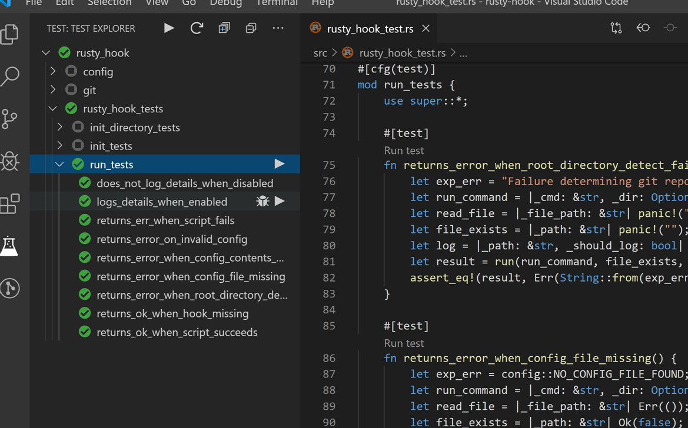
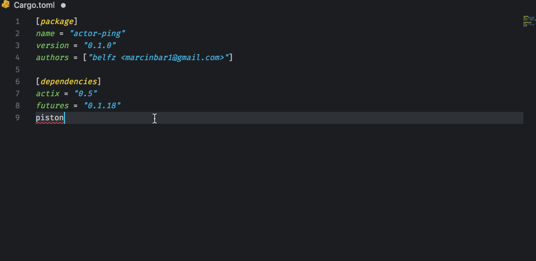
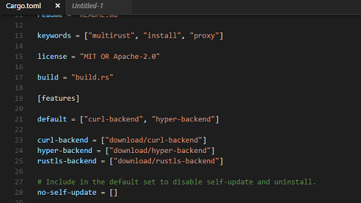

# Rust in Gitpod

Welcome, Rustacean!

Rust is a first-class language in Gitpod, and we believe that Gitpod is a great tool for Rust projects. Some of Gitpod's core developers frequently work with Rust code (in Gitpod), and several key components of Gitpod are written in Rust:

* The fantastic language support is provided by the [rls](https://github.com/rust-lang/rls)
* The blazing-fast workspace search is powered by [ripgrep](https://github.com/BurntSushi/ripgrep)

## Rust Version
Both Rust `v1.39.0 stable` and `nightly` are pre-installed in Gitpod. Stable is the default, but you can switch to the nightly version of Rust by running `rustup default nightly` in a terminal.

Note: If you try to use `rustup` in your Dockerfile, you might get the following error:

```
/bin/sh: rustup command not found
```

To fix this you'll need to wrap the `rustup` command in a login shell, like so:

```Dockerfile
RUN bash -cl "rustup toolchain install nightly"
```

You can override this default by committing a `rustup-toolchain` file in the root of your repository. Say for example you need the nightly compiler for March 4th, 2020, you would create a `rustup-toolchain` file and add the following
```text
nightly-2020-03-04
```
which will set the required Rust version and if you commit the file into source control it will set the default nightly version across all workspaces.

## Example Repositories

Here are a few Rust example projects that are already automated with Gitpod:

<div class="table-container">

| Repository  | Description  | Try it    |
|---------|------------|-----|
|[MathLang](https://github.com/JesterOrNot/mathlang) | Basic maths language in Rust | [](https://gitpod.io/#https://github.com/JesterOrNot/MathLang) |
|[NuShell](https://github.com/nushell/nushell/) | A next-gen shell for the GitHub era | [](https://gitpod.io/#https://github.com/nushell/nushell) |
|[Servo](https://github.com/servo/servo) | The Servo Browser Engine | [](https://gitpod.io/#https://github.com/servo/servo)

</div>

## Workspace Configuration

### VSCode Extensions

The most popular Rust VSCode extensions come prebuilt in Gitpod but here are some "nice to have" extensions:

#### Rust Test Explorer

<br>
<br>
The Rust Test Explorer makes it easy to run Rust tests. To install this extension to your repository, add the following to your [.gitpod.yml](https://www.gitpod.io/docs/41_config_gitpod_file/):
```yaml
vscode:
  extensions:
    - hbenl.vscode-test-explorer@2.15.0:koqDUMWDPJzELp/hdS/lWw==
    - Swellaby.vscode-rust-test-adapter@0.11.0:Xg+YeZZQiVpVUsIkH+uiiw==
```
#### Crates
> ***Note: This extension outputs emojis by default if the crate version is set at the latest. You can disable this by using `crates.upToDateDecorator` option in your preferences***
<br>


The VSCode extension Crates makes it easier to manage your Cargo dependency versions. To install this extension to your repository add the following to your [.gitpod.yml](https://www.gitpod.io/docs/41_config_gitpod_file/)

```yaml
vscode:
  extensions:
    - serayuzgur.crates@0.4.7:HMkoguLcXp9M3ud7ac3eIw==
```
#### <p>Search Crates.io</p>


Do you have an idea of a library you want to use but don't know the version well just type in the name of the library and Search Crates.io will get the version. To install this extension to your repository add the following to your [.gitpod.yml](https://www.gitpod.io/docs/41_config_gitpod_file/)
```yaml
vscode:
  extensions:
    - belfz.search-crates-io@1.2.1:kSLnyrOhXtYPjQpKnMr4eQ==
```

#### Better TOML


Better TOML adds syntax highlighting to your `Cargo.toml`. To install Better TOML to your repository, add the following to your [.gitpod.yml](https://www.gitpod.io/docs/config-gitpod-file/) file:

```yaml
vscode:
  extensions:
    - bungcip.better-toml@0.3.2:3QfgGxxYtGHfJKQU7H0nEw==
```

## Debugging

In this section we will show you how to configure your project for debugging in Gitpod.

First, before we get to that we need to get some prerequisites set-up first we'll add the needed extension

If you haven't added extensions to your repository already add the following snippet to your [.gitpod.yml](https://www.gitpod.io/docs/config-gitpod-file/) file:

```yaml
vscode:
  extensions:
    - webfreak.debug@0.24.0:1zVcRsAhewYEX3/A9xjMNw==
```

If you already added a extension just add the following below your other extensions.

```yaml
    - webfreak.debug@0.24.0:1zVcRsAhewYEX3/A9xjMNw==
```

The last prerequisite is a docker configuration.

If you already have a [.gitpod.Dockerfile](https://www.gitpod.io/docs/config-docker/) just add the following:

```Dockerfile
RUN sudo apt-get -q update \
    && sudo apt-get install -yq \
        libpython3.6 \
        rust-lldb \
    && sudo rm -rf /var/lib/apt/lists/*

ENV RUST_LLDB=/usr/bin/lldb-8
```

If not there are two steps first create a file called `.gitpod.Dockerfile` with the following content:

```Dockerfile
FROM gitpod/workspace-full

USER gitpod

RUN sudo apt-get -q update \
    && sudo apt-get install -yq \
        libpython3.6 \
        rust-lldb \
    && sudo rm -rf /var/lib/apt/lists/*

ENV RUST_LLDB=/usr/bin/lldb-8
```

Next add the following to your [.gitpod.yml](https://www.gitpod.io/docs/config-gitpod-file/) file:

```yaml
image:
  file: .gitpod.Dockerfile
```

Now that thats out of the way, here is a video on how to configure the debug configuration


So, basically in this video we:
1. Go to the debug menu and select "Add Configuration..."
2. Next, in the dropdown choose "GDB: Launch Program"
3. Go to the `Cargo.toml` file and find the name of the program.
4. Modify the target field and change it to `${workspaceFolder}/target/debug/<PROGRAM_NAME>` where `<PROGRAM_NAME>` is the name of the program under the name field in the `Cargo.toml` file.
5. Add another property to the created file called `preLaunchTask` and set it to "cargo"
6. Go to the terminal menu and click configure tasks
7. Select cargo build from the menu that pops up
8. change the tag `type` to `command`
9. change the tag `subcommand` to `args` and the value to `["build"]`
10. Next remove the `problemMatcher` field.
11. Add a field called `type` and set it to `process`
12. Add a field called `label` and set it to `cargo`
13. Go to the Rust file you want to debug
14. Add a breakpoint or two
15. Go back to the debug menu that has the crossed out spider
16. Click the green run button.
17. Finally, start debugging your Rust program!

You can also create the Rust debug configuration file manually

To start debugging your Rust application in Gitpod, please create a new directory called `.theia/`, and inside add a file called `launch.json`, add the following to it:

```json
{
  // Use IntelliSense to learn about possible attributes.
  // Hover to view descriptions of existing attributes.
  "version": "0.2.0",
  "configurations": [
      {
          "type": "gdb",
          "request": "launch",
          "name": "Debug Rust Code",
          "preLaunchTask": "cargo",
          "target": "${workspaceFolder}/target/debug/rust_debug",
          "cwd": "${workspaceFolder}",
          "valuesFormatting": "parseText"
      }
  ]
}
```

Next create another file in the same `.theia/` directory called `tasks.json` with the following content:

```json
{
    "tasks": [
        {
            "command": "cargo",
            "args": [
                "build"
            ],
            "type": "process",
            "label": "cargo",
        }
    ],
}
```

Then, simply open the Rust file you want to debug, add some breakpoints, and open the Debug panel (in the left vertical toolbar, click the icon with the crossed-out-spider), and click the green "Run" button.

<br>


To see a basic repository with Rust debugging configured, please check out [gitpod-io/Gitpod-Rust-Debug](https://github.com/gitpod-io/Gitpod-Rust-Debug):

[](https://gitpod.io/#https://github.com/gitpod-io/Gitpod-Rust-Debug)

<br>

## Further Reading

* ***[Rocket-Example](https://www.gitpod.io/blog/docker-in-gitpod/)*** For an example of how to setup a project for the [`Rocket`](https://rocket.rs/) web-development framework
