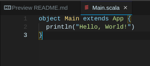
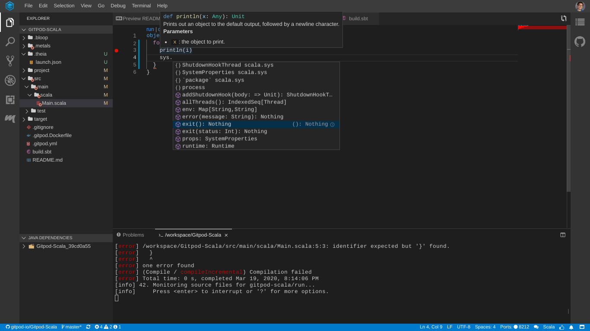
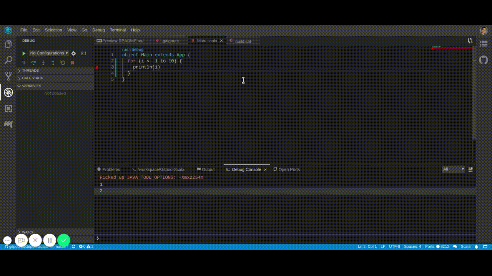

# Scala in Gitpod

Welcome, Scala programmer. Today we will show you how to configure Gitpod for your project.

## Installing Scala

First, you'll probably want to install Scala. To do this, add a new file to your repository called [.gitpod.Dockerfile](https://www.gitpod.io/docs/config-docker/), and add the following content to it:

```Dockerfile
FROM gitpod/workspace-full

RUN brew install scala
```

Additionally create a file called [.gitpod.yml](https://www.gitpod.io/docs/config-gitpod-file/) and add the following:

```YAML
image:
  file: .gitpod.Dockerfile
```

Now commit both files into source control.

### What are these files for?

Let's break this down. First, in `.gitpod.Dockerfile`, we declare `FROM gitpod/workspace-full` to have your project use Gitpod's default workspace image (recommended). You can use other images too, but some Gitpod features might not work as well with untested images.

Next, we declare `RUN brew install scala`. This simply installs Scala into the workspace image via HomeBrew.

Then, we register our custom Dockerfile in Gitpod's configuration file `.gitpod.yml`, so that Gitpod knows it should pick it up and build it on-the-fly when booting up new workspaces.

Finally, please note that these changes will only take effect in new workspaces. To try out your new automated dev setup, simply commit both files; push them to GitHub; and then open a new Gitpod workspace for your repository. 🚀

## Using the Ammonite REPL


To install the [Ammonite REPL](https://ammonite.io/) in Gitpod, you must add the following to our previously-created [.gitpod.Dockerfile](https://www.gitpod.io/docs/config-docker/):

```Dockerfile
RUN sudo sh -c '(echo "#!/usr/bin/env sh" && curl -L https://github.com/lihaoyi/Ammonite/releases/download/2.0.4/2.13-2.0.4) > /usr/local/bin/amm && chmod +x /usr/local/bin/amm'
```

Then commit the changes and push to your repository. Finally, when you open a new workspace, you will be able to type `amm` in the terminal, and behold a super cool Scala REPL in your workspace!

## Building projects with sbt

To use [sbt](https://www.scala-sbt.org/) (simple build tool) in Gitpod, you can add the following to that [.gitpod.Dockerfile](https://www.gitpod.io/docs/config-docker/) we created:

```Dockerfile
RUN brew install sbt
```

As usual, commit and push the changes, and `sbt` will be installed in all future workspaces.

## Managing Scala versions with scalaenv

Say your project needs a specific Scala version. You can use [scalaenv](https://github.com/scalaenv/scalaenv), a version manager for Scala, to switch between different Scala versions. But first, we must install `scalaenv`. As usual, we need to change our [.gitpod.Dockerfile](https://www.gitpod.io/docs/config-docker/), by adding this to it:

```Dockerfile
RUN brew install scalaenv
```

Then, say you need Scala version `2.12.11`, you would add the following line as well:

```Dockerfile
RUN scalaenv install scala-2.12.11 && scalaenv global scala-2.12.11
```

## Using coursier, an artifact fetcher for Scala

[coursier](https://get-coursier.io/) is useful for building certain Scala projects and installing different tools.

```Dockerfile
RUN brew install coursier/formulas/coursier
```

(Don't forget to commit and push this change!)

## Formatting Scala code with scalafmt

To install [scalafmt](https://scalameta.org/scalafmt/) for your repository, add the following to your [.gitpod.Dockerfile](https://www.gitpod.io/docs/config-docker/):

```Dockerfile
RUN sudo env "PATH=$PATH" coursier bootstrap org.scalameta:scalafmt-cli_2.12:2.4.2 \
  -r sonatype:snapshots \
  -o /usr/local/bin/scalafmt --standalone --main org.scalafmt.cli.Cli
```

Then to format your code simply run `scalafmt`!

## Putting it all together

A full example of a [.gitpod.Dockerfile](https://www.gitpod.io/docs/config-docker/) configured for Scala could look something like:

```Dockerfile
FROM gitpod/workspace-full

RUN sudo sh -c '(echo "#!/usr/bin/env sh" && curl -L https://github.com/lihaoyi/Ammonite/releases/download/2.0.4/2.13-2.0.4) > /usr/local/bin/amm && chmod +x /usr/local/bin/amm'

RUN brew install scala coursier/formulas/coursier sbt scalaenv

RUN sudo env "PATH=$PATH" coursier bootstrap org.scalameta:scalafmt-cli_2.12:2.4.2 \
  -r sonatype:snapshots \
  -o /usr/local/bin/scalafmt --standalone --main org.scalafmt.cli.Cli

RUN scalaenv install scala-2.12.11 && scalaenv global scala-2.12.11
```

You will notice that all the `brew install` commands are on the same line. We recommend grouping similar commands together to minimize the number of [Docker layers](https://docs.docker.com/develop/develop-images/dockerfile_best-practices/#minimize-the-number-of-layers).

Additionally, your [.gitpod.yml](https://www.gitpod.io/docs/config-gitpod-file/) file should still look like this:

```YAML
image:
  file: .gitpod.Dockerfile
```

## VSCode Extensions

### Scala Syntax (official)



Scala Syntax adds basic syntax highlighting for Scala and `sbt` files.

To get it, open Gitpod's **Extensions** panel (left vertical menu in the IDE), then search for "Scala Syntax", and install it "for this project". Then, commit the automatic `.gitpod.yml` change that was made by Gitpod.

### Metals



Metals adds helpful Scala features to Gitpod, for example, advanced autocompletion and debugging support just to name a few. Although to use it you must also have the previously mentioned Scala Syntax.

To get it, open Gitpod's **Extensions** panel (left vertical menu in the IDE), then search for "Scala Metals", and install it "for this project". Then, commit the automatic `.gitpod.yml` change that was made by Gitpod.

Boom! You're done! (Just a reminder, don't forget to push the changes.)

## Debugging Scala code

To debug Scala code in Gitpod you should use the Metals extension which we just went over. Here is an example of Scala Debugging in action:



In general when debugging Scala code, go to the main method, and click the Debug button over it! And boom you're debugging.

## Try it!

To see a minimal repository with a Gitpod configuration that installs all the tools we've covered, see [gitpod-io/Gitpod-Scala](https://github.com/gitpod-io/Gitpod-Scala). You can try it in your browser:

[](https://gitpod.io/#https://github.com/gitpod-io/Gitpod-Scala)

## Need help?

If you are having trouble and need help please find us in the [Gitpod community](https://community.gitpod.io/), or, [file an issue on GitHub](https://github.com/gitpod-io/gitpod/issues/new/choose).

## Feedback

We love feedback and want to continuously improve all of our guides and documentation. If you found a grammar mistake, or we left out your favorite Scala tool, or you just have general feedback on the guide, please feel free to [edit this guide](https://gitpod.io/#https://github.com/gitpod-io/website/blob/master/src/docs/languages/scala.md) or to [file a website issue on GitHub](https://github.com/gitpod-io/website/issues/new/choose).
