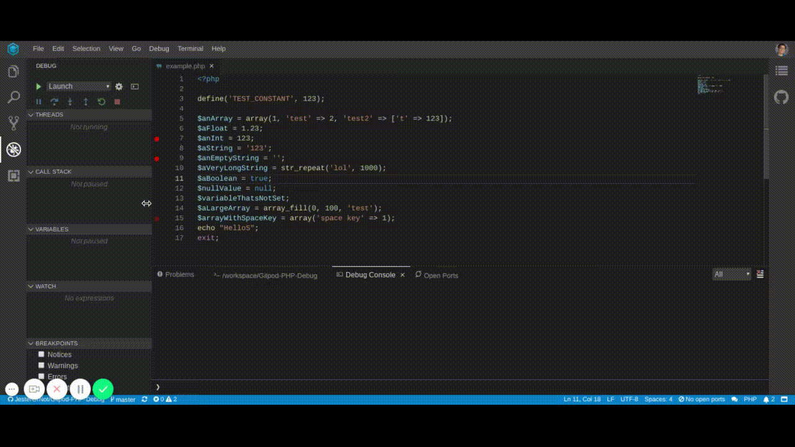

# PHP in Gitpod

Gitpod supports PHP right out of the box, but more advanced features such as debugging can be configured, so here is how to do it!

## Example Repositories

| Repository | Description | Try it |
|------------|-------------|--------|
| magento2gitpod | Magento 2 optimized setup for Gitpod: Nginx, MySQL, PHP 7.2, PHP-FPM and more | [](https://gitpod.io/#https://github.com/nemke82/magento2gitpod) |
| koel | A personal music streaming server that works | [](https://gitpod.io/#https://github.com/phanan/koel) |
| symfony-demo | Symfony Demo Application |[](https://gitpod.io/#https://github.com/gitpod-io/symfony-demo)
## VSCode Extensions
### PHP Debug


The PHP Debug extension allows debugging PHP applications from within Gitpod.

To get this extension for your project, you must do two things:

First you must create a [`.gitpod.Dockerfile`](https://www.gitpod.io/docs/config-docker/) for your repository:

```Dockerfile
FROM gitpod/workspace-full


RUN sudo apt-get update -q \
    && sudo apt-get install -y php-dev

RUN wget http://xdebug.org/files/xdebug-2.9.1.tgz \
    && tar -xvzf xdebug-2.9.1.tgz \
    && cd xdebug-2.9.1 \
    && phpize \
    && ./configure \
    && make \
    && sudo cp modules/xdebug.so /usr/lib/php/20170718 \
    && sudo bash -c "echo -e '\nzend_extension = /usr/lib/php/20170718/xdebug.so\n[XDebug]\nxdebug.remote_enable = 1\nxdebug.remote_autostart = 1\n' >> /etc/php/7.2/cli/php.ini"
```

Second, reference the above Dockerfile in a [`.gitpod.yml`](https://www.gitpod.io/docs/config-gitpod-file/) file, and then also install the extension, like so:

```yaml
image:
  file: .gitpod.Dockerfile
# This is to get rid of the annoying popup feel free to leave this out
ports:
  - port: 9000
    onOpen: ignore
vscode:
  extensions:
    - felixfbecker.php-debug@1.13.0:WX8Y3EpQk3zgahy41yJtNQ==
```

Finally, here is a full [example repository](https://github.com/JesterOrNot/Gitpod-PHP-Debug) containing the complete Gitpod PHP debug configuration described above. You can try it by clicking here:

[](https://gitpod.io/#https://github.com/JesterOrNot/Gitpod-PHP-Debug)

## PECL package manager in Gitpod
The default workspace image also ships with the PECL package manager installed to install packages with it you must add these instructions to your [`.gitpod.Dockerfile`](https://www.gitpod.io/docs/config-docker/)
```Dockerfile
RUN sudo pecl channel-update pecl.php.net && sudo pecl install <PACKAGE>
``` 
where package equals the thing you want to install.
