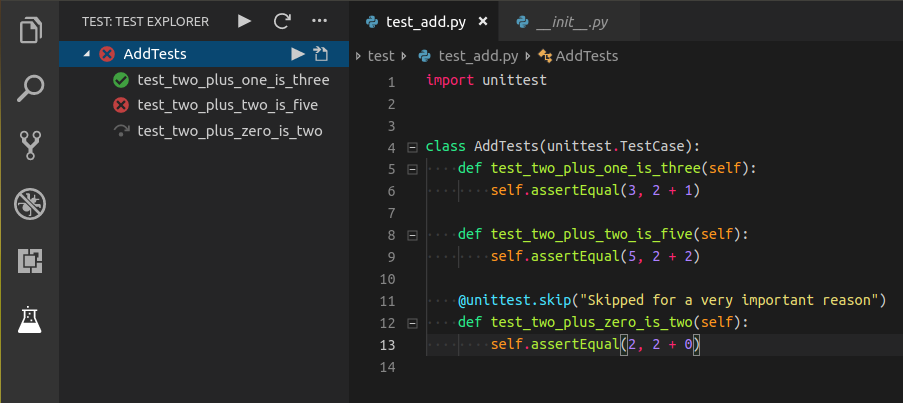

# Python in Gitpod

Gitpod comes with great support for Python built-in. Still, depending on your project, you might want to further optimize the experience.

## Python Project Examples

Before we get started, here are some examples of already-[gitpodified](https://www.gitpod.io/blog/gitpodify/) repositories!

<div class="table-container">

| Repository                                                                                                |                                                                                                              Description |                                        Try it |
-----------|-----------------------------------------------------------|----------------------------------------------------
| [gitpod-io/django-locallibrary-tutorial](https://github.com/gitpod-io/django-locallibrary-tutorial) | An example website written in Django by MDN |        [](https://gitpod.io/#gitpod-io/django-locallibrary-tutorial) |
| [JesterOrNot/Gitpod-PyQt](https://github.com/JesterOrNot/Gitpod-PyQt)                               |    A PyQt example for Gitpod | [](https://gitpod.io/#https://github.com/JesterOrNot/Gitpod-PyQt) |
| [gitpod-io/wxPython-example](https://github.com/gitpod-io/wxPython-example)                      | A wxPython example for Gitpod    | [](https://gitpod.io/#https://github.com/gitpod-io/wxPython-example) |
| [techwithtim/Hangman](https://github.com/techwithtim/Hangman)                                       |   A wxPython example for Gitpod  |     [](https://gitpod.io/#https://github.com/techwithtim/Hangman) |

</div>

## Python Versions

Gitpod workspaces come with Python versions: `2.7.17`, and `3.7.3` pre-installed by default.

The easiest way to install a new Python version is to use `pyenv install <VERSION>`. For example, suppose you wanted to install Python `3.6.4`, you would run `pyenv install 3.6.4`.

You can switch between Python versions using `pyenv local <VERSION>`. For example, if you wanted to switch to Python version `2.7.17` you would run `pyenv local 2.7.17`. This will create a `.python-version` file that controls which Python version is the default in your project. (Note: When running it in a Dockerfile, replace `local` with `global` to change the system default.)

## [Start tasks](https://www.gitpod.io/docs/config-start-tasks/)

You can start building your project when, or even [before](https://www.gitpod.io/docs/prebuilds/) you start your Gitpod workspace. Are you using a `requirements.txt` file to manage dependencies? If so, add this to your [.gitpod.yml](https://www.gitpod.io/docs/config-gitpod-file/) to automatically pre-install all dependencies when starting a workspace:
```yaml
tasks:
  - init: pip3 install -r requirements.txt
    command: python3 main.py
```

## VSCode Extensions
While the most popular Python VSCode extensions are built into Gitpod, here are a few "nice to have" extensions that you can use as well.

### ARepl for Python

ARepl for Python is helpful for constantly checking your code and debugging.
To install this extension for your repository, add the following to your [.gitpod.yml](https://www.gitpod.io/docs/config-gitpod-file/):
```yaml
vscode:
  extensions:
    - almenon.arepl@1.0.20:Uu7lIOwyLgmNWpTwCl/iqQ==
```
### Python Test Explorer

Easily test your python extensions with the Python Test Explorer.
To add this to your repository add the following to your [.gitpod.yml](https://www.gitpod.io/docs/config-gitpod-file/)
```yaml
vscode:
  extensions:
    - littlefoxteam.vscode-python-test-adapter@0.3.16:tZ/6xOSSdKUaq6JCUVkD+A==
```

## GUI Applications with wxPython

To install wxPython to your repository please add the following to your [.gitpod.Dockerfile](https://www.gitpod.io/docs/config-docker/). If you don't have one, simply run [`gp init`](https://www.gitpod.io/docs/command-line-interface/) and commit the two generated files.

```dockerfile
# This will pull the official Gitpod `vnc` image
# which has much of what you need to start
FROM gitpod/workspace-full-vnc

USER gitpod

# Install wxPython dependencies
RUN sudo apt-get -q update && \
    sudo DEBIAN_FRONTEND=noninteractive apt-get install -yq freeglut3-dev python3.7-dev libpython3.7-dev libgl1-mesa-dev libglu1-mesa-dev libgstreamer-plugins-base1.0-dev libgtk-3-dev libnotify-dev libsdl2-dev libwebkit2gtk-4.0-dev libxtst-dev libgtk2.0-dev && \
    sudo rm -rf /var/lib/apt/lists/*

# Install wxPython
RUN pip3 install -U -f https://extras.wxpython.org/wxPython4/extras/linux/gtk3/ubuntu-18.04/ wxPython
```

Here is a corresponding [.gitpod.yml](https://www.gitpod.io/docs/config-gitpod-file/) example:

```yaml
image:
  file: .gitpod.Dockerfile

# This will expose all necessary ports needed for your VNC image
ports:
  - port: 6080
    onOpen: open-preview
  - port: 5900
    onOpen: ignore
  - port: 35900
    onOpen: ignore

# This will make it so that on workspace start it will run a file called `app.py`
tasks:
  - command: python3 app.py
```
<br>
We also support other GUI frameworks such as `Kivy` and `PyQt`
<br>
Here are some other examples of Python GUI applications in Gitpod:

<div class="table-container">

| Name             | Framework | Try it |
|------------------|----------------|-----------|
| Tic-Tac-Toe-GUI  | Kivy | [](https://gitpod.io/#https://github.com/JesterOrNot/Tic-Tac-Toe-GUI) |
| Pong             | Kivy | [](https://gitpod.io/#https://github.com/JesterOrNot/Pong) |
| Gitpod-PyQt | PyQt | [](https://gitpod.io/#https://github.com/JesterOrNot/Gitpod-PyQt) |

</div>

<br>

## Debugging
Here is a quick clip on how to automatically configure debugging for Python!


So, basically in this video we:
1. First, open the Python file that we want to debug
2. Then, go to the debug menu and select "Add Configuration..."
3. Next, in the dropdown choose "Python"
4. Next, choose "Python File" as the debug configuration
5. Finally, start debugging your Python program!

You can also create the Python debug configuration file manually

To start debugging your Python application in Gitpod, please create a new directory called `.theia/`, and inside add a file called `launch.json`, finally add the following to it:
```json
{
    "version": "0.2.0",
    "configurations": [
        {
            "name": "Python: Current File",
            "type": "python",
            "request": "launch",
            "program": "${file}",
            "console": "internalConsole"
        }
    ]
}
```
Then, simply open the Python file you want to debug, open the Debug panel (in the left vertical toolbar, click the icon with the crossed-out-spider), and click the green "Run" button.

<br>


To see a basic repository with Python debugging enabled, please check out [JesterOrNot/Gitpod-Python-Debug](https://github.com/JesterOrNot/Gitpod-Python-Debug):

[](https://gitpod.io/#https://github.com/JesterOrNot/Gitpod-Python-Debug)

<br>


## Resources
* ***[VSCode documentation for Python debugging](https://code.visualstudio.com/docs/python/debugging)*** All the information there should also apply to Gitpod as well.
* ***[Troubleshooting Matplotlib/TK](https://github.com/gitpod-io/gitpod/issues/795)*** Here is how to troubleshoot Matplotlib/TK issues for Python GUI applications.
* ***[Debugging Django](https://community.gitpod.io/t/django-debugging/381/6)*** This is how to debug Django applications in Gitpod.
