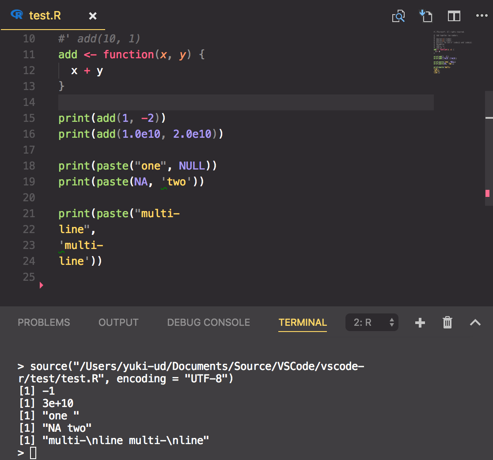

# R in Gitpod

To work with R in Gitpod, you will need to properly configure your repository. Here is how to do it.

## Installing R

First, you'll probably want to install R itself. To do this, add a new file to your repository called [`.gitpod.Dockerfile`](https://www.gitpod.io/docs/config-docker/), and add the following content to it:

```Dockerfile
FROM gitpod/workspace-full

RUN brew install R
```

Next, create a Gitpod configuration file called `.gitpod.yml` (you can also simply run `gp init` and Gitpod will generate the file), and reference the above Dockerfile in it like so:

```yml
image:
  file: .gitpod.Dockerfile
```

Then commit and push both files to your repository. After that, every new Gitpod workspace created for your project will have R pre-installed.

## VSCode Extensions

### R Extension


To install the R extension to your repository, add the following to your [`.gitpod.yml`](https://www.gitpod.io/docs/config-gitpod-file/) file:

```yaml
vscode:
  extensions:
    - Ikuyadeu.r@1.2.1:z5vr1v1bfS++U/aHLSXQ6Q==
```

Here is a minimal example of [R running in Gitpod](https://github.com/gitpod-io/Gitpod-R). You can try it here:

[](https://gitpod.io/#https://github.com/gitpod-io/Gitpod-R)
