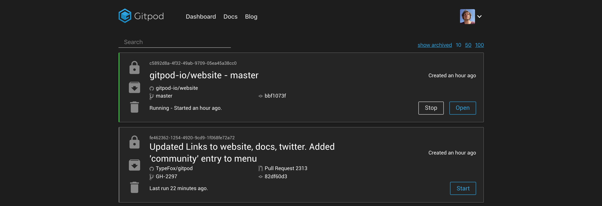

# April 2019

Today we are happy to announce that we are moving out of beta.
We want to thank all the beta testers who have provided great feedback. Gitpod wouldn't be what it is without you! ❤️

You can read more about the announcement in [the blog post](https://www.gitpod.io/blog/gitpod-launch).

Besides a complete relaunch of the website and app, we have added some very exciting new features:

## GitHub App / Prebuilt Workspaces 🚀

We have been busy developing a [new GitHub app](https://github.com/marketplace/gitpod-io), that once installed on your repository will prebuild your project on every push.
On GitHub pull requests this is communicated through a status check.

As a result, Gitpod is now the first IDE that builds your project, before you open it.

Read more about this exciting feature in [the docs](https://www.gitpod.io/docs/46_Prebuilds) and in [Chris' blog post](https://www.gitpod.io/blog/prebuilds).

## Better `localhost` Handling

When starting web servers in Gitpod, often times you need to explicitly make sure the dev server allows connections from non-localhost.
Starting today, you no longer need to worry about that. Gitpod now forwards the port locally and rewrites the host headers,
so that dev servers will be fine.

## Better Go Support

Gitpod now directly uses Microsoft's great Go support for VS Code.

## Unlimited Hours

If you don't feel comfortable with a time-based limit, you can now purchase the 'Unlimited' plan to use Gitpod as much as you like on public and private repositories.

We also offer [unlimited subscriptions for teams](https://gitpod.io/teams) and [for students](https://www.gitpod.io/pricing) the price for an Unlimited subscription is only 9$/8€.

> If you have created your account during the beta, i.e. before April 5th, you will be able to work on private repositories for another month.

You can check out the various [pricing options on the website](https://www.gitpod.io/pricing).

## New Design 💄

As part of the launch, we have overhauled the design of Gitpod. The website and dashboard now is in dark theme as well and the UI of the
IDE is more closely matching the look of VS Code.

## Delete Workspace

You can now delete workspaces in the dashboard. Please note, that deletion can not be reversed as we are really
deleting all the contents of your workspace.

You can also delete your entire account (Hopefully the most unused feature).

## Many Small Improvements

Besides these bigger features, we have fixed many bugs and improved the performance and user experience of Gitpod.
We have merged 146 PRs in Gitpod and [206 in Theia](https://github.com/theia-ide/theia/pulls?utf8=%E2%9C%93&q=is%3Apr+merged%3A%3E2019-02-05+).

## What's next?

With this release we have already added some VS Code extensions. Going forward we will double down on the integration.
We are looking at one programming language after the other, making sure the experience is excellent and the VS Code extensions
work as epected. Once we've reached a state where we are confident VS Code extensions work reliably in general, we will allow users to install them.
Furthermore, we are focussing on start-up time improvements and, of course, bugfixing and helping you having a great development experience.
