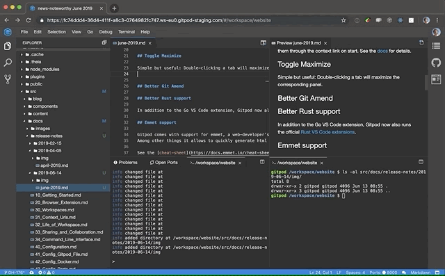
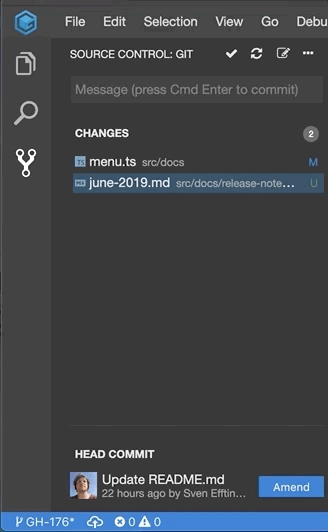

# June 2019

Time for a new release notes listing all the features and changes we have deployed in the past two months.

After the launch we have spent significant time on making our internal architecture fit for better scaling and density in the cloud as well
as supporting VS Code extension. This work is not finished yet, but we have done a few other cool things as well.

Please find the most exciting new features listed below:

## Links in terminals

You can now follow links and open files from the terminal by clicking on the respective links.

## Environment Variables

Gitpod allows users to inject environment variables into workspaces. Based on a simple pattern against the repository name
one can filter which env vars are actually injected. Also note that all environment variable values are encrpyted before stored in the database.

In addition to user-based environemnt variables you can pass them through the context link on start. See the [docs](/docs/47_Environment_Variables/) for details.

## Toggle Maximize

Simple but useful: Double-clicking a tab will maximize the corresponding panel.

## Better Git Amend

The git amend UI has been improved so that you can amend / squash multiple commits but also
undo that.

## Better Rust support

In addition to the Go VS Code extension, Gitpod now also runs the official [Rust VS Code extensions](https://github.com/rust-lang/rls-vscode).

## Emmet support

Gitpod comes with support for emmet, a web-developer’s toolkit that can greatly improve your HTML & CSS workflow.
Among other things it allows to quickly generate html boilerplate using shortcuts.

See the [cheat-sheet](https://docs.emmet.io/cheat-sheet/) for a quick overview of what's supported.

## Debugging in Java

The debugging of Java applications had a problem in that it the process would pick a wrong java executable when launching processes.
This is now fixed.

## Improved C++ Language Support

We have upgrade the language services to use the latest clangd version.

## Config: Port ranges

In your `.gitpod.yml` one can now specify port ranges, so you can manage antire ranges addition
and tell Gitpod what to do when a service opens on one of those ports.

## CLI: _gp await-port_

The cli learned a new thing, that let's you wait for a certain port to open.
This is useful if you want to open a specific URL instead of the default one.

## Many Small Improvements
Besides these bigger features, we have fixed many bugs and improved the performance and user experience of Gitpod.
We have merged 146 PRs in Gitpod and [220 in Theia](https://github.com/theia-ide/theia/pulls?utf8=%E2%9C%93&q=is%3Apr+merged%3A%3E2019-04-01+).

 - upload does not block UI anymore and does not have limits
 - bi-directional scroll sync between markdown and preview

## What's next?

With this release we have added some additional VS Code extensions.
The upcoming release will allow you to install arbitrary VS Code extensions and add that as configuration to your `.gitpod.yml` files.
The GitLab integration as well as a easy-to-install, self-hosted version of Gitpod is in the works.
Finally, we are looking into optimizing start-up time improvements and, of course, bug-fixing and offering you a great development experience.
