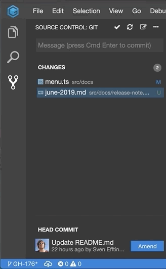

# June 2019

After the public launch of Gitpod.io in April, we have spent most of our time on changing our internal architecture to better scale and improve the cloud density as well
as supporting VS Code extension. Although this work is not yet finished, we have added a bunch of new features on the way, which are listed below.

## Toggle Maximize

Simple but useful: Double-clicking a tab will maximize the corresponding panel.


## Links in terminals

You can now follow links and open files from the terminal by clicking on the respective links.


## Environment Variables

Gitpod allows users to inject environment variables into workspaces. Based on a simple pattern against the repository name
one can filter which env vars are actually injected. Also please note that all environment variable values are encrpyted before stored in the database.

In addition to user-based environment variables, you can pass environment variables through the context link on start.
See the [docs](/docs/47_environment_variables/) for more information.

## Bi-directional Scroll Sync

When editing markdown files it is very convenient to see the preview next to the editor. You can open a preview by click the icon on the top right of the editor.
Now you can scroll both the editor or the preview and see how the other part is scrolling with it, showing the corresponding sections.


Contributed through [PR #5442](https://github.com/theia-ide/theia/pull/5442).

## Better Rust support

In addition to the Go VS Code extension, Gitpod now also runs the official [Rust VS Code extensions](https://github.com/rust-lang/rls-vscode).
So expect faster and more reliable support for Rust.

## Emmet support

Gitpod comes with support for emmet, a web-developer’s toolkit that can greatly improve your HTML & CSS workflow.
Among other things it allows to quickly generate html boilerplate using shortcuts.


See the [cheat-sheet](https://docs.emmet.io/cheat-sheet/) for a quick overview of what's supported.

## Debugging in Java

The debugging of Java applications had a problem in that it the process would pick a wrong java executable when launching processes.
This is now fixed.

## Better Upload

You can now upload large files through drag and drop and see proper progress information on the top of the window.


## Improved C++ Language Support

We have upgrade the language services to use the latest clangd version.

## Better Git Amend

The git amend UI has been improved so that you can amend / squash multiple commits but also
undo that.



Also the entire SCM widget has been rewritten to match VS Code's UX.

## Config: Port ranges

In your `.gitpod.yml` one can now specify [port ranges](/docs/43_config_ports/#port-ranges), so you can manage antire ranges addition
and tell Gitpod what to do when a service opens on one of those ports.

## CLI: _gp await-port_

The cli learned a new thing, that let's you wait for a certain port to open.
This is useful if you want to wait for a certain path and then take a specific action.

Here's an example that will open a certain path in the preview once a service is a available port 3000:

```sh
gp await-port 3000 && gp preview $(gp url 3000)my/path/index.html
```

## Many Small Improvements
Besides these bigger features, we have fixed many bugs and improved the performance and user experience of Gitpod.
We have merged 146 PRs in Gitpod and [220 in Theia](https://github.com/theia-ide/theia/pulls?utf8=%E2%9C%93&q=is%3Apr+merged%3A%3E2019-04-01+).

## What's next?

With this release we have added some additional VS Code extensions.
The upcoming release will allow you to install arbitrary VS Code extensions and add that as configuration to your `.gitpod.yml` files.
The GitLab integration as well as a easy-to-install, self-hosted version of Gitpod is in the works.
Finally, we are looking into optimizing start-up time improvements and, of course, bug-fixing and offering you a great development experience.
