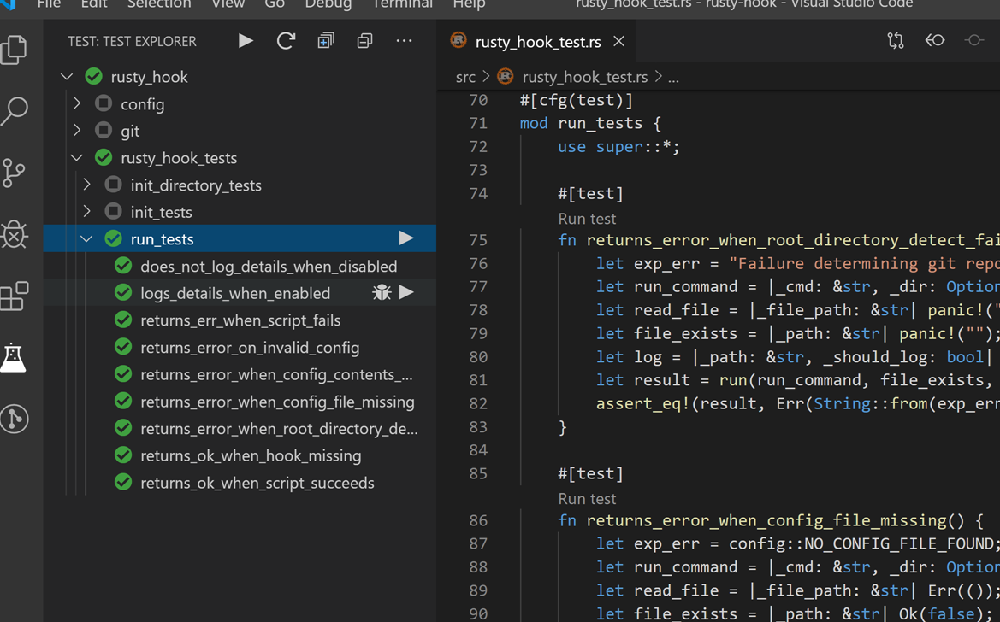
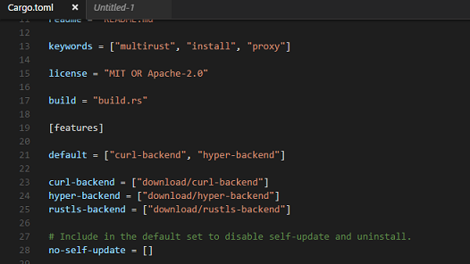

# Rust in Gitpod

Welcome, Rustacean!

Rust is a first-class language in Gitpod, and we believe that Gitpod is a great tool for Rust projects. In fact, some of Gitpod's core developers frequently work with Rust code (in Gitpod), and several key components of Gitpod are written in Rust:

* The fantastic language support is provided by the [rls](https://github.com/rust-lang/rls)
* The blazing-fast workspace search is powered by [ripgrep](https://github.com/BurntSushi/ripgrep)

## Rust Version
Both Rust `v1.39.0 stable` and `nightly` are pre-installed in Gitpod. Stable is the default, but you can switch to the nightly version of Rust by running `rustup default nightly` in a terminal.

Note: If you try to use `rustup` in your Dockerfile, you might get the following error:

```
/bin/sh: rustup command not found
```

To fix this you'll need to wrap the `rustup` command in a login shell, like so:

```Dockerfile
RUN bash -cl "rustup toolchain install nightly"
```

## Example Repositories

Here are a few Rust example projects that are already automated with Gitpod:

<div class="table-container">

| Repository  | Description  | Try it    |
|---------|------------|-----|
|[MathLang](https://github.com/JesterOrNot/mathlang) | Basic maths language in Rust | [](https://gitpod.io/#https://github.com/JesterOrNot/MathLang) |
|[NuShell](https://github.com/nushell/nushell/) | A next-gen shell for the GitHub era | [](https://gitpod.io/#https://github.com/nushell/nushell) |
|[Servo](https://github.com/servo/servo) | The Servo Browser Engine | [](https://gitpod.io/#https://github.com/servo/servo)

</div>

## Workspace Configuration

### VSCode Extensions

The most popular Rust VSCode extensions come prebuilt in Gitpod but here are some "nice to have" extensions:

#### Rust Test Explorer

<br>
<br>
The Rust Test Explorer makes it easy to run Rust tests. To install this extension to your repository, add the following to your [.gitpod.yml](https://www.gitpod.io/docs/41_config_gitpod_file/):
```yaml
vscode:
  extensions:
    - hbenl.vscode-test-explorer@2.15.0:koqDUMWDPJzELp/hdS/lWw==
    - Swellaby.vscode-rust-test-adapter@0.11.0:Xg+YeZZQiVpVUsIkH+uiiw==
```
#### Crates
> ***Note: This extension outputs emojis by default if the crate version is set at the latest. You can disable this by using `crates.upToDateDecorator` option in your preferences***
<br>


The VSCode extension Crates makes it easier to manage your Cargo dependency versions. To install this extension to your repository add the following to your [.gitpod.yml](https://www.gitpod.io/docs/41_config_gitpod_file/)

```yaml
vscode:
  extensions:
    - serayuzgur.crates@0.4.7:HMkoguLcXp9M3ud7ac3eIw==
```
#### <p>Search Crates.io</p>


Do you have an idea of a library you want to use but don't know the version well just type in the name of the library and Search Crates.io will get the version. To install this extension to your repository add the following to your [.gitpod.yml](https://www.gitpod.io/docs/41_config_gitpod_file/)
```yaml
vscode:
  extensions:
    - belfz.search-crates-io@1.2.1:kSLnyrOhXtYPjQpKnMr4eQ==
```

#### Better TOML


Better TOML adds syntax highlighting to your `Cargo.toml`. To install Better TOML to your repository, add the following to your [.gitpod.yml](https://www.gitpod.io/docs/41_config_gitpod_file/) file:
```yaml
vscode:
  extensions:
    - bungcip.better-toml@0.3.2:3QfgGxxYtGHfJKQU7H0nEw==
```

## Resources
* ***[Rocket-Example](https://www.gitpod.io/blog/docker-in-gitpod/)*** For an example of how to setup a project for the [`Rocket`](https://rocket.rs/) web-development framework
