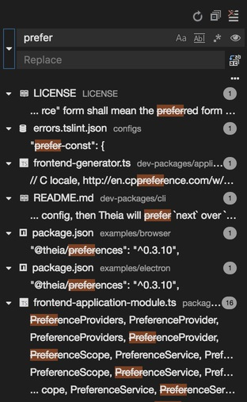
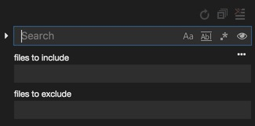
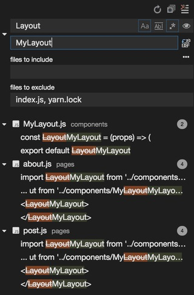
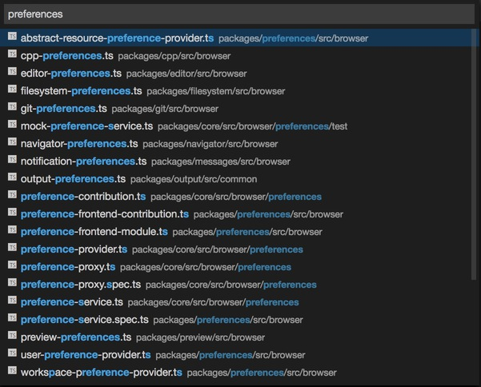
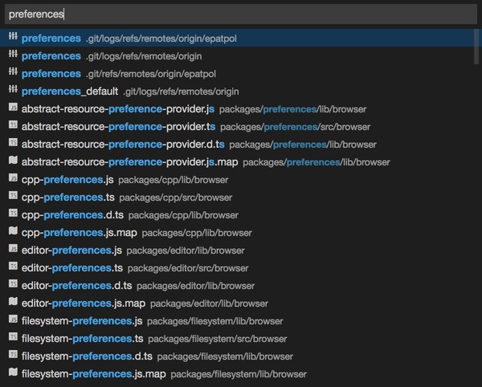
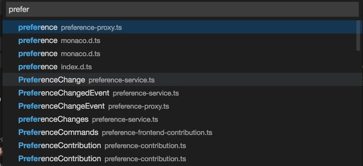
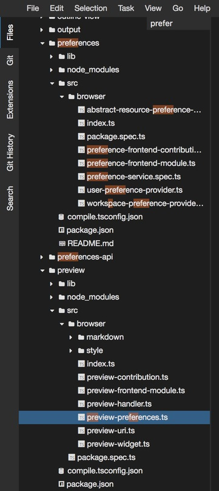
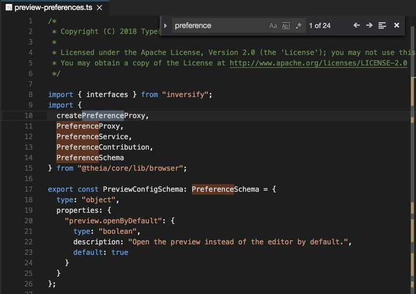

# Search

There are several ways to perform a search and to find things in the workspace:

- [Search in Workspace](#search-in-workspace)
- [Open File](#open-file)
- [Open Workspace Symbol](#open-workspace-symbol)
- [Navigator Search](#navigator-search)
- [Find and Replace in Editor](#find-and-replace-in-editor)

## Search in Workspace

The `Search in Workspace` command will bring up the `Search` view. Run it either through the
command palette or by pressing <kbd>Ctrl+Shift+F</kbd> (<kbd>⌘+Shift+F</kbd> on macOS).

In the `Search` view, you can start typing, and the matching results will be shown automatically
without pressing <kbd>Enter</kbd>. The search can be restricted to case matching, whole word
matching, or the query can be given as a regular expression. Search results are
grouped by file, with an indication of the number of occurrences and the file's path. Expand a file
to see a preview of all of the hits within that file. Then single-click on one of the hits to view
it in the editor.

### Advanced Search Options

In the input box below the search box, you can enter patterns to include or exclude from the search.
If you enter `theName`, it will match every directory and file named `theName` in the workspace. If you
enter `./theName`, it will match the directory `theName/` at the top level of your workspace. Use `!`
to exclude those patterns from the search. `!theName` will skip searching any directory or file named
`theName`. You can also use globbing syntax:

- `*` to match one or more characters in a path segment,
- `?` to match on one character in a path segment,
- `**` to match any number of path segments, including none,
- `{}` to group conditions (e.g., `{**/*.html,**/*.txt}` matches all HTML and text files), and
- `[]` to declare a range of characters to match (e.g., `theName.[0-9]` to match on `theName.0`,
  `theName.1`, …).

Theia excludes some directories by default (for instance, `node_modules` and others that are ignored
through `.gitignore`) to reduce the number of search results. If you would like to search for all files in
the workspace, click on the `Include Ignored Files` in the search field.

### Search and Replace

You can also `Search and Replace` across files. Expand the `Search` widget to display the `Replace`
text box.

When you type text into the `Replace` text box, you will see a diff display of the pending changes.
You can replace across all files from the `Replace` text box, replace all in one file, or replace a
single change. Double-clicking on any of the `Search and Replace` occurrences, opens the file in a
diff editor so that you can review the modification in the editor before eventually applying them.

## Open File

Use <kbd>Ctrl+P</kbd> (<kbd>⌘+P</kbd> on macOS) to search files in the workspace by name. By
default, hidden and ignored files do not show up among the results.

If you want to include all files in this search, press <kbd>Ctrl+P</kbd> once again.

Selecting a file will open it in an editor.

## Open Workspace Symbol

Press <kbd>Ctrl+O</kbd> (<kbd>⌘+O</kbd> on macOS) to find symbols in the workspace. Note: what kinds
of symbols are searchable is language-specific.

## Navigator Search

When the `Files` navigator is in focus, start typing to highlight all those files whose names match
your pattern. This search ignores all collapsed files in the navigator. When the navigator search is
active and there are highlighted files, you can use the cursor arrows to jump the matching resources
in the navigator. You can finish your search anytime by hitting <kbd>Esc</kbd>, or by deleting your
pattern with <kbd>Backspace</kbd>.

Use this to quickly locate a file in the `Files` navigator.

## Find and Replace in Editor

Press <kbd>Ctrl+F</kbd> (<kbd>⌘+F</kbd> on macOS) in the editor to open the `Find`/`Replace` search
widget. It is recommended to use this search functionality if you want to find something in a given
file. As always, alternatively, you can use the command palette (look for `Find`) or the `Edit` >
`Find` menu item to open the search widget.

This functionality helps you finding all occurrences in a single file. Your query can match the
whole word, can be case sensitive, or even a regular expression. It also provides a convenient way
to replace all you search occurrences.
