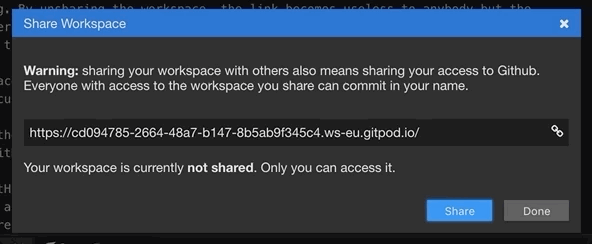
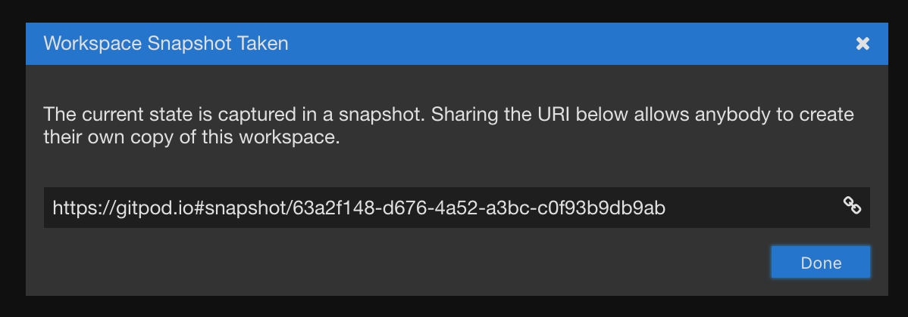

# Collaboration & Sharing of Workspaces

There are two different ways to share your workspaces:

 - [Sharing Running Workspaces](#sharing-running-workspaces)
 - [Sharing Snapshots](#sharing-snapshots)

## Sharing Running Workspaces

Sharing running workspaces makes it possible to quickly look at a workspace together with a (remote) colleague.
It is similar to collaborating on Google Docs, in that you can see who is online and look at the same code and processes.

All users in one workspace share the Theia backend and the filesystem. Opened editors, terminals,
and other UI state are currently not shared.

### How To Share and Unshare a Running Workspace

Running workspaces can be shared from within the IDE.
Click on the user's avatar and choose

`Share Running Workspace`.

Provide the URL shown in the dialog to
anyone you want to share your workspace with.

> **Security note:**
>
> Beware, anybody with this URL and a Gitpod account will be able to access the workspace as long as
it is shared and running.
>
> Every action involving git in a shared workspace happens on behalf of the workspace owner's account without further authorization.
> It is highly recommended to give workspace URLs only to trusted users and unshare workspaces as soon as sharing them is no longer necessary.
>
> **A running Gitpod workspace really is your personal machine.**

By unsharing the workspace, the link becomes useless to anybody but the
workspace owner. All users that are currently looking at your workspace will be shown as avatars in
the top right corner of the IDE.

## Sharing Snapshots

You can take snapshot URLs of your workspaces at any time and share them with others.
Anyone clicking on such a snapshot link will get a complete clone of your workspace, including the
 - state of the workspace
 - the IDE layout

Workspaces created from snapshots are treated as restarts, so you can configure them to launch
differently than if you had created a fresh workspace from git. Also, this is useful if you want to create
easy-to-consume reproducible workspace states, for issues, stackoverflow answers, trainings, etc.

Unlike sharing running workspaces, snapshotted workspaces are full copies. This means users can do whatever
they like with the content. And of course, no access to any of your credentials is shared.

Read more about this feature [here](/blog/workspace-snapshots).

### How To Take a Snapshot URL

Creating a snapshot is simple. You can either use the __command palette__ (<kbd>F1</kbd>) or find the action item in
the avatar menu on the top right.

Once you execute it, the snapshot is taken and the URL is shown in a dialog.

