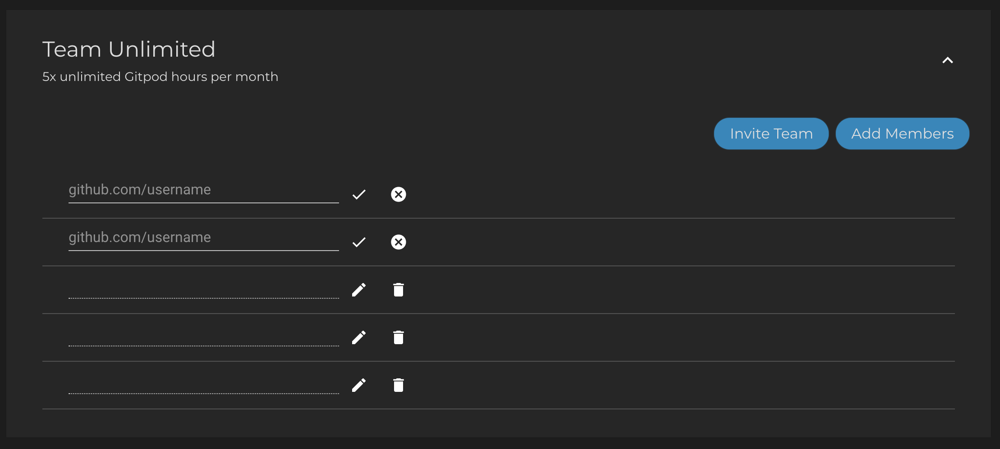

# Create a Team
From [gitpod.io/teams/](https://gitpod.io/teams/), you can purchase and manage Gitpod subscriptions for your entire team with one centralized billing.

If you don’t have a Gitpod account yet, you’ll be asked to create one first. You can then choose between the Team Professional or Team Unlimited plan and add members to it.
  

  
Afterwards you can choose how many seats you wish to purchase, and in which currency you would like to be billed.
Then you have two options for adding your team members.

You can either directly assign a seat by entering your team member's GitHub username, or use the `Invite Team` button and get a shareable link. Send the link to your team, and they can claim a seat.
  

## Good to know
* You don’t need to have a subscription yourself in order to manage seats for your team. You can simply sign in to https://gitpod.io/teams/ for free.
* If you’d like to add more seats, delete seats or reassign existing seats, you can do these changes at any time.
  
