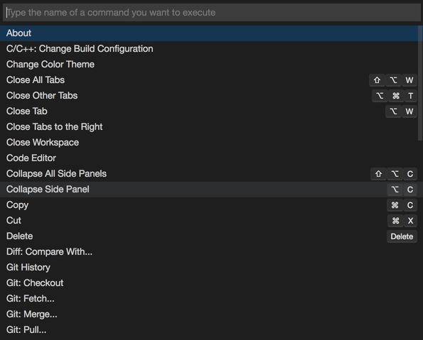
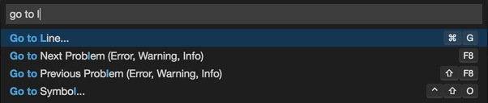
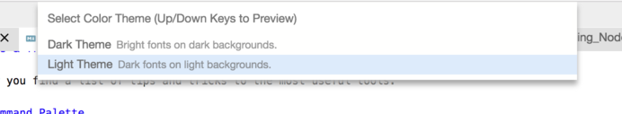
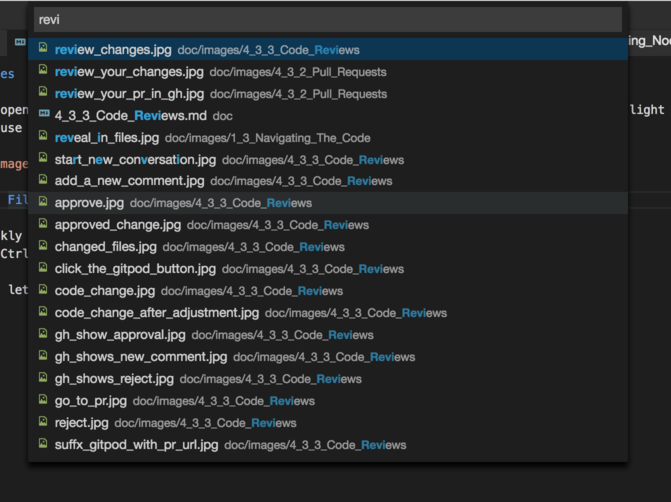

# Tips & Tricks

  * [Command Palette](#command-palette)
  * [Color Themes](#color-themes)
  * [Open File](#open-file)
  * [Search in Workspace](#search-in-workspace)
  * [Symbols and References](#symbols-and-references)
  * [Format Document](#format-document)

## Command Palette

The _command palette_ is at the core of a keyboard-centric interaction, and can be also useful for
looking up available commands and key bindings. It is available through the following keyboard
shortcut:
  - <kbd>F1</kbd>

### Command Palette Context

The command palette lists only those commands that are available in the current context. For
example, the `Go To Line...` command shows in the palette only when a code editor is opened and has
focus.

## Color Themes

Gitpod opens in its _dark theme_. If you prefer a lighter experience, you can switch to the _light
theme_. Simply use the command palette and select `Change Color Theme`.

## Open File

To quickly open any file using the keyboard, press:
  - <kbd>Ctrl+P</kbd> (<kbd>⌘+P</kbd> on macOS).

It will let you search, find, and open any file by name.

## Search in Workspace

To search for or to replace string occurrences in all files of your workspace, press:
  - <kbd>Ctrl+Shift+F</kbd> (<kbd>⌘+Shift+F</kbd> on macOS)

It opens the search view, which is described in more detail [here](search.md).

## Symbols and References

Most languages allow to name things and refer to them in other places, for example variables,
functions, classes, modules etc. Gitpod supports the notion of _symbols_ and _references_, and lets
you navigate between them in both directions:

  - `Open Symbol` (<kbd>Ctrl+Shift+O</kbd>) finds a symbol by its name.
  - `Find All References` (<kbd>Shift+F12</kbd>) lists all references to the symbol at the current
     position in an inline editor.
  - `Go to Definition` (<kbd>Ctrl+F12</kbd> or <kbd>Ctrl/⌘</kbd>+click) brings you to the definition
     of a symbol. `Peek Definition` (<kbd>Alt+F12</kbd>) does the same in an inline editor.
  - `Rename Symbol` (<kbd>F2</kbd>) renames the symbol and changes all references to it accordingly.

## Format Document

To tidy up your code, many languages support `Format Document` (<kbd>Alt+Shift+F</kbd>).
If you want to apply this to only a subsection of the current document, select the desired region
and pick `Format Selection` from the editor's context menu.
