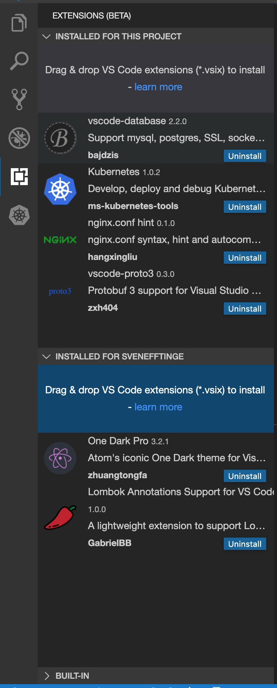

# VS Code Extensions (Beta)

Without further configuration, Gitpod comes well equipped for most development tasks including language support for some of the most popular programming languages, such as Python, JavaScript, Java, Go, C/C++, Ruby, Rust, etc.

In professional projects, however, you might miss one or the other functionality, which you can add through a VS Code Extension.

## Installing an Extension

Installing extensions is a matter of dragging and dropping a `*.vsix` file into the IDE's Extensions view. Gitpod will automatically install and activate the new extension, and add an entry to the `.gitpod.yml` file. You can now test the experience and if you are happy with it share this new experience with your team by pushing the change to your remote Git repository.

Here’s a short screencast:

`youtube: hEqmXM62cjo`

Once you have uploaded an extension, the `.gitpod.yml` is updated automatically. Of course you can also directly edit extensions sections in the editor to delete an extension or copy some of them from another project's `.gitpod.yml`.

Here is an example of how an extensions section might look like:

```yml
vscode:
  extensions:
    - Dart-Code.flutter@3.3.0-beta.4:wCqXa/Ih/LTzfyko19agfQ==
    - Dart-Code.dart-code@3.3.0-beta.4:z+hDckQldFt7W9jYHkgiTQ==
```

## User Extensions

You can also install extensions at the user level. This can be useful for extensions that you typically use in all your projects (e.g. a custom theme) and this doesn't require changing each project's configuration.

To do this, simply drag and drop a `*.vsix` file into the "Installed for (user)" section of the Extensions view:

<div style="width: 250px"></div>

## Built-in Extensions

Gitpod already comes with a suite of commonly used VS Code extensions pre-installed by default.

You can view all pre-installed extensions by expanding the "Built-in" section at the bottom of the IDE's Extensions view.

## Where do I find extensions?

Microsoft prohibits the direct use of the [Visual Studio Marketplace](https://marketplace.visualstudio.com/vscode) for any other software but their own. Although most extensions are open-source and not even developed or maintained by MS, the access to the Marketplace is restricted.

However, if you have the `.vsix` file available, you can upload the extension yourself. `.vsix` files are not only available from the Visual Studio Marketplace but can be found in the [Open VSX](https://open-vsx.org/) marketplace and on [GitHub as well](https://github.com/prettier/prettier-vscode/releases).

An extension only needs to be uploaded once and is available for you and your teammates afterwards. Please make sure you comply with the licenses of those extensions.
Additionally, of course, you can develop and upload your own extensions. They won’t be listed anywhere publicly except in your own .gitpod.yml.

## An extension doesn't work as expected?

Covering the full API surface of VS Code extension is a huge task and the Theia community has been working hard on that for over a year now.

As we are approaching 100% coverage of the implementation it is time to expose this feature to more users. Which is why we decided to make it available as a beta feature to the Gitpod community.

So if you want to help us hardening this exciting new feature, please try your favorite extensions and [submit issues on the Theia project](https://github.com/theia-ide/theia/issues/new) for anything that you think needs improving.
