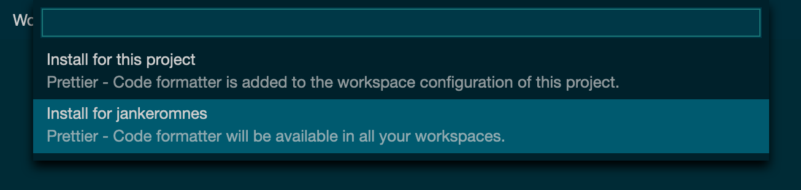

# VS Code Extensions

Gitpod already comes well equipped for most development tasks, and provides language support for the most popular programming languages such as Python, JavaScript, Go, Rust, C/C++, Java, Ruby, and many more out of the box.

Still, you may wish to customize Gitpod, or to extend it with new features. You can do this by installing VS Code extensions.

## Installing an Extension

To install a VS Code extension in Gitpod, simply go to the left vertical menu, and open the Extensions view. There you can search for an extension (uses the [Open VSX](https://open-vsx.org/) registry) and install it in one click.

Here’s a short screencast:

`youtube: eD_GQ2lQug8`

Once an extension is installed, your project's `.gitpod.yml` is updated automatically. You can also directly edit this file to install or remove extensions manually.

Here is an example of what a `.gitpod.yml` with installed extensions may look like:

```yml
vscode:
  extensions:
    - scala-lang.scala@0.3.9:O5XmjwY5Gz+0oDZAmqneJw==
    - scalameta.metals@1.9.0:KNju0fLBpNiyqH8qBfFeIQ==
```

You can share the installed extensions with your team by committing the `.gitpod.yml` change and pushing it to your Git repository.

## User Extensions

You can also install extensions at the user level. This can be useful for extensions that you want to have in all your projects (for example a custom theme), and this doesn't require changing every project's `.gitpod.yml` configuration.

To do this, simply select `Install for (user)` when prompted by the IDE while installing an extension:



## Built-in Extensions

Gitpod already comes with a number of commonly used VS Code extensions pre-installed by default.

You can view all pre-installed extensions by expanding the "Built-in" section at the bottom of the IDE's Extensions view.

## Where do I find extensions?

If you cannot find an extension by searching in Gitpod, it probably means that the extension wasn't added to the [Open VSX](https://open-vsx.org/) registry yet.

In that case, you can also install it by drag-and-dropping a `*.vsix` file into the IDE's Extensions view. Gitpod will automatically install and activate the new extension, and add an entry to your `.gitpod.yml` file.

- `.vsix` extension files can be found in the [Open VSX](https://open-vsx.org/) registry and [on GitHub](https://github.com/prettier/prettier-vscode/releases) as well.

- Please note that `.vsix` files downloaded from the [Visual Studio Marketplace](https://marketplace.visualstudio.com/vscode) should not be installed in Gitpod, because Microsoft prohibits the direct use of their marketplace by any non-Microsoft software, even though most extensions are actually open source and not developed or maintained by Microsoft.

- You can of course also develop and install your own extensions. Note that installing a `.vsix` file in Gitpod will not list that extension anywhere publicly except in your own `.gitpod.yml`, so you can also install private extensions that way.

## An extension doesn't work as expected?

Covering the full API surface of VS Code extensions is a huge endeavor and the Theia community has been hard at a work for over a year now.

Today, with nearly 100% coverage of the implementation achieved, we've decided to make this exciting new feature available to everyone in the Gitpod community.

If you want to help us hardening VS Code extension support in Gitpod, please try installing your favorite extensions and [submit issues on the Theia project](https://github.com/theia-ide/theia/issues/new) for anything that you think needs to be improved.
