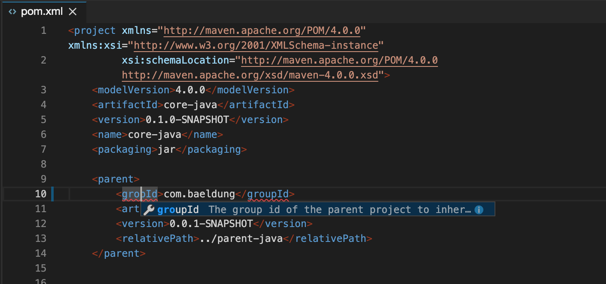

# February Release 2019 🎉

We are close to leaving the beta phase and with that are also approaching a more regular release schedule.
This means we are going to have monthly release notes. They will pop up only once and you can easily dismiss them by pressing <kbd>[ESC]</kbd>.
If you want to look up the release notes later you can open them through the command palette <kbd>[F1]</kbd>. Simply search for 'Release Notes'.

So here are the new & noteworthy things that we have been hard at work at this time.

## GitHub Links

You can now navigate to GitHub directly from the editor. The GitHub URL of any editor position or selection can be accessed with a right-click, and used for example in GitHub issues or Pull Request comments to reference interesting code locations.


## Snapshots

In addition to live sharing a running Gitpod workspace, you can now take a snapshot. Snapshots capture the current state of a workspace session including the UI layout and the file changes. Anyone who has a snapshot link can create a fresh workspace based on that.

This is super handy for providing reproducibles in GitHub issues and StackOverflow posts. They are also great to prepare trainigs, tutorials, or just to showcase stuff you have thrown together.

Please see this [blog post](https://medium.com/gitpod/code-never-lies-creating-reproducibles-for-any-programming-language-7946021a68f2) as well as the [documentation](https://docs.gitpod.io/33-Sharing-and-Collaboration.html#sharing-snapshots) for more details.


## Configuration

The possibilities to fine-tune the developer experience when using Gitpod on your repository have been improved. Here are the features you can define in your `.gitpod.yml`:

### Tasks
You can now specify multiple tasks. Each task will have its own terminal view on start. You can even specify where those terminals whould be opened.
The following config, for instance, will make sure that two terminals are opened next to each other.

```yaml
tasks:
 - command: echo 'left'
 - command: echo 'right'
   openMode: split-right
```


### Lifecycles

In addition we have introduced multiple lifecycle phases for the tasks, such as [init](https://docs.gitpod.io/44-Config-Start-Tasks.html#init-command) and [before](https://docs.gitpod.io/44-Config-Start-Tasks.html#before-command). The main purpose is to avoid rerunning unnecessary commands such as full builds, when restarting workspaces or opening snapshots.

Check the table below for an overview of the different starting scenarios.

<div class="table-container">

| Start Mode | Execution |
| ---------  | -------   |
| Fresh Workspace | `before && init && command` |
| Restart Workspace | `before && command` |
| Snapshot | `before && command` |

</div>

### Ports

You can now specify the default behavior on port detection. By default users get a notification when starting a server, asking whether they want to open a web view or an external browser.

This behavior can now be pre-configured so users are not bothered with annoying notifications. Here is an example where we configure port `8080` to automatically open in a web preview pane:

```yaml
ports:
 - port: 8080
   onOpen: open-preview
```

Check out [the docs](https://docs.gitpod.io/44-Config-Start-Tasks.html) to learn more about pre-configuring things in Gitpod.

## YAML Support

Gitpod now understands YAML syntax and uses json schema specifications to validate and guide developers. While this works for any YAML files it comes in especially handy when editing `.gitpod.yml`.


## Gitpod CLI

The CLI for Gitpod has learned new tricks. Check out all the cool things you can do with it by typing `gp help`.

Here are the new commands we added:

### gp init

To get the best experience with Gitpod, you should configure your repository to have the right tools, run the right commands on start, etc. This information is stored in a `.gitpod.yml` file sitting in your repository.

The `gp init` command walks you through the basic setup and generates a `.gitpod.yml` and if desired a corresponding `Dockerfile`.

```sh
gitpod /workspace/my-repo $ gp init
Use the arrow keys to navigate: ↓ ↑ → ←
? Workspace Docker image:
  ▸ default
    custom image
    docker file
```

More information about writing `.gitpod.yml` configurations can be found in [the docs](https://docs.gitpod.io/40-Configuration.html).

### gp url

One of the things you do in a `.gitpod.yml` is declaring the exposed ports. Gitpod maps them to a specific subdomain in order to make them accessible. For instance if you have a dev server running on `0.0.0.0:3000` the `gp url` command gives you the external url for that service.

Here is an example:
```sh
gitpod /workspace/release-notes $ gp url 3000
https://3000-b33f605e-b32a-4e44-ae5a-acad9641de0a.ws-eu0.gitpod.io/
```

`gp url` can also give you the URL of the workspace itself:
```sh
gitpod /workspace/release-notes $ gp url
https://b33f605e-b32a-4e44-ae5a-acad9641de0a.ws-eu0.gitpod.io/
```

### gp preview

`gp preview` is similar to `gp open`, except that it does not open a file in the editor but a URL in a preview pane on the right.

This is especially handy together with `gp url` if you want to open a specific path from a script.

Here's an example:
```sh
gp preview $(gp url 3000)my/special/path.html
```

## Improved Docker Performance

In addition to the `.gitpod.yml` you can provide a `Dockerfile` which is automatically picked up by Gitpod. See [this blog post](https://medium.com/gitpod/bring-your-own-docker-image-to-gitpod-52db1aa861de) for more information on setting up a Dockerfile for your project.

For example, here is a Dockerfile that allows developing native UI applications in Go on Gitpod:

```sh
FROM gitpod/workspace-full-vnc
RUN apt-get update \
    && apt-get install -y libgtk-3-dev
```

Since we launched this feature, the performance and logging for docker builds have also been improved significantly.

## Status Page

As we continuously improve and expand Gitpod, there are times when things inevitably don't go as planned, occasionally causing downtime. If you're ever curious about the status of [gitpod.io](https://gitpod.io), or you'd like to follow how we resolve an incident, we made [status.gitpod.io](https://status.gitpod.io/) just for you.

In fact, thanks to [Statusfy](https://github.com/bazzite/statusfy), it took us just a few hours to build an entire [open source status page](https://github.com/gitpod-io/gitpod-status). Learn more about this short adventure in [this blog post](https://medium.com/gitpod/status-update-gitpod-%EF%B8%8F-statusfy-ed8266d63a20).

## Java Debugging

In addition to Node.js one can now also launch and debug Java applications directly from within the editor. Code lense actions on `main()` methods will automatically use the right classpath from the current project settings (based on maven, gradle or eclipse classpath information).

Launch configs are stored in a VS Code compatible `launch.json` file.


## XML Support

The new improved XML support not only does syntax highlighting for XML and XSD but also uses associated schemas to provide diagnostics, content assist and hover information.



## Better Previews

Previews can now easily be opened by clicking on the top right icon () on any previewable files, such as Markdown, HTML and SVG files.

The inverse is supported, too. I.e. clicking the file icon on the top right of a preview will open the corresponding editor on the left. For Markdown even scrolling is synced between the two views.

## AsciiDoc Support

In addition to Markdown, Gitpod now also supports previewing AsciiDoc as you type.


## Many Bugfixes, small features and other improvements

These are just the most noteworthy features we have been working on.
For a more detailed list of bugfixes and enhancemenst see all the issues we've closed:

 - [Closed Issues in Gitpod](https://github.com/gitpod-io/gitpod/issues?utf8=%E2%9C%93&q=is%3Aissue+is%3Aclosed+closed%3A%3E2018-11-01)
 - [Merged PRs in Theia](https://github.com/theia-ide/theia/pulls?utf8=%E2%9C%93&q=merged%3A%3E2018-11-01+merged%3A%3C2018-02-13+)
